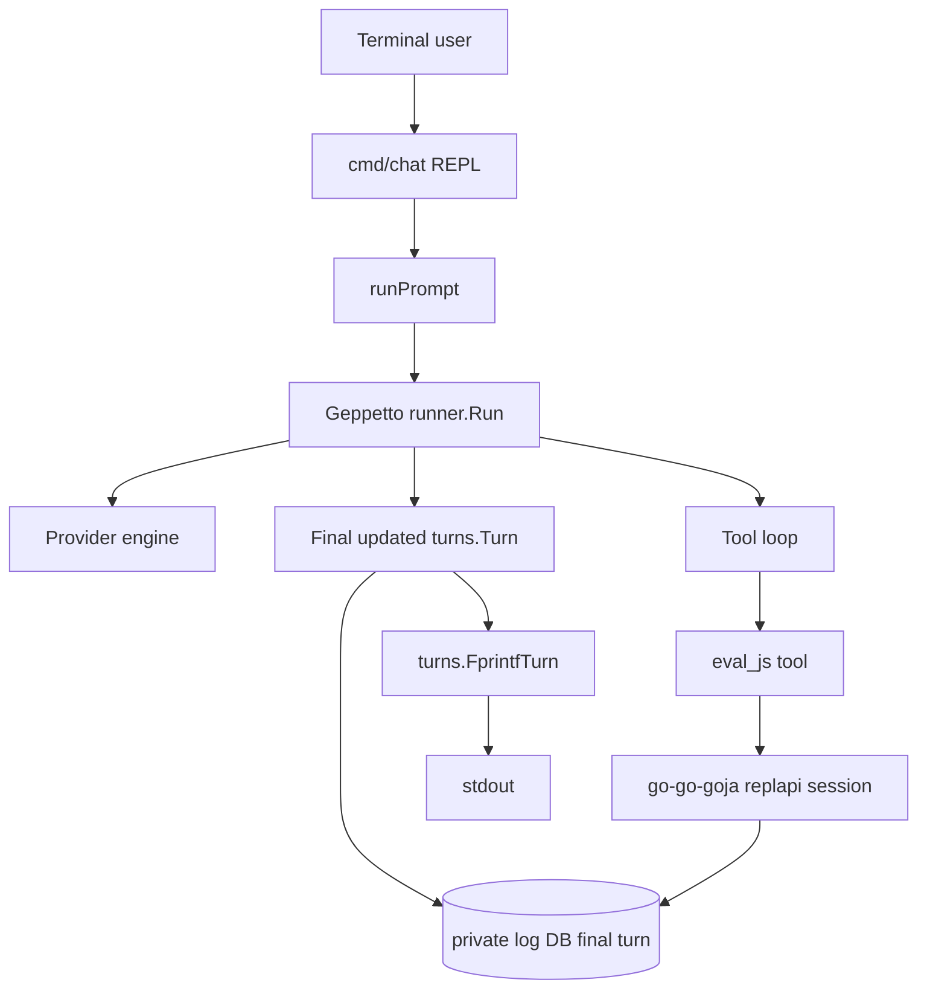
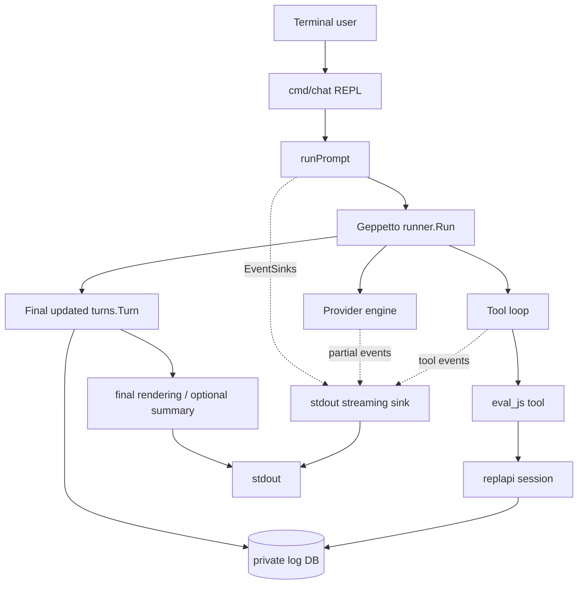
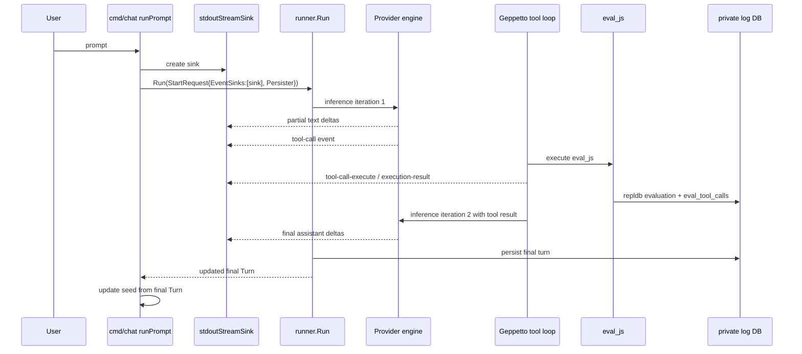

# Streaming stdout output design

## 1. What this guide is for

This guide explains how to add streaming stdout output to the `chat` command in `/home/manuel/code/wesen/2026-04-29--go-go-agent`. It is written for a new intern who has not yet worked with this codebase. The goal is not merely to say "attach an event sink." The goal is to build the mental model needed to understand why streaming belongs where it does, how Geppetto emits streaming events, how the current REPL prints output, and how to implement the feature without breaking final turn persistence or the private eval logging database.

By the end, you should understand five things:

- The `chat` binary is a small command-line application that resolves an LLM profile, builds an `eval_js` tool, and calls Geppetto's runner for each user prompt.
- Geppetto supports streaming through `events.EventSink`. Provider engines publish events such as text deltas and tool call notifications into sinks attached to the run context.
- The current `chat` command does not stream. It waits for `runner.Run` to finish, then prints the entire final `turns.Turn` with `turns.FprintfTurn`.
- The correct integration point is `runner.StartRequest.EventSinks`, not direct polling, not a separate provider API call, and not parsing the final turn as it grows.
- The implementation should separate live streaming output from final transcript rendering. Streaming is for user experience; the final turn remains canonical for persistence and conversation state.

The most important design rule is this: **streaming output is display-only.** It should not be used as durable state. The durable state is still the final `turns.Turn` returned by `runner.Run` and persisted by `logDB.TurnPersister()`.

## 2. The current system in one picture

The current command is a REPL. Each prompt is read from stdin, sent through the runner, and printed only after completion.



The missing piece is the live event stream. Provider engines are already capable of publishing events while inference is running. The `chat` command simply does not attach a stdout event sink yet.

The target system adds a sink:



## 3. File map: where to look first

A new intern should start with a small set of files. Do not begin by reading the entire Geppetto repository. The important path is narrow.

| File | Why it matters |
|---|---|
| `/home/manuel/code/wesen/2026-04-29--go-go-agent/cmd/chat/main.go` | The command entrypoint. This is where flags are defined, the REPL reads prompts, `runner.Run` is called, and stdout is currently written. |
| `/home/manuel/code/wesen/corporate-headquarters/geppetto/pkg/inference/runner/types.go` | Defines `runner.StartRequest`, including `EventSinks`, `SnapshotHook`, and `Persister`. |
| `/home/manuel/code/wesen/corporate-headquarters/geppetto/pkg/inference/runner/prepare.go` | Shows how `StartRequest.EventSinks` flows into `enginebuilder.Builder.EventSinks`. |
| `/home/manuel/code/wesen/corporate-headquarters/geppetto/pkg/inference/runner/run.go` | Shows that `Run` is synchronous from the caller's perspective: it starts inference and waits. |
| `/home/manuel/code/wesen/corporate-headquarters/geppetto/pkg/inference/toolloop/enginebuilder/builder.go` | Shows how event sinks are attached to the context with `events.WithEventSinks`. |
| `/home/manuel/code/wesen/corporate-headquarters/geppetto/pkg/events/sink.go` | Defines the `EventSink` interface. This is the interface our stdout sink should implement. |
| `/home/manuel/code/wesen/corporate-headquarters/geppetto/pkg/events/context.go` | Defines `WithEventSinks`, `GetEventSinks`, and `PublishEventToContext`. |
| `/home/manuel/code/wesen/corporate-headquarters/geppetto/pkg/events/chat-events.go` | Defines event types such as `partial`, `partial-thinking`, `tool-call`, `tool-call-execute`, and `tool-call-execution-result`. |
| `/home/manuel/code/wesen/corporate-headquarters/geppetto/pkg/events/step-printer-func.go` | Existing reference for printing events to an `io.Writer`. Useful, but probably too generic/noisy to use directly as the final CLI UX. |

## 4. Current `cmd/chat` behavior

The current `runPrompt` function is the center of the feature. It builds a `runner.StartRequest`, calls `r.Run`, waits until the model/tool loop is complete, and then prints the entire updated turn.

Current shape:

```go
func runPrompt(ctx context.Context, r *runner.Runner, runtime runner.Runtime, logDB *logdb.DB, logDBTurnSnapshots bool, seed *turns.Turn, prompt string, out io.Writer) error {
    req := runner.StartRequest{
        SeedTurn: seed,
        Prompt:   prompt,
        Runtime:  runtime,
    }
    if logDB != nil {
        req.SessionID = logDB.ChatSessionID
        if logDBTurnSnapshots {
            req.SnapshotHook = logDB.SnapshotHook()
        }
        req.Persister = logDB.TurnPersister()
    }
    _, updated, err := r.Run(ctx, req)
    if err != nil {
        return err
    }
    fmt.Fprintln(out)
    turns.FprintfTurn(out, updated, turns.WithToolDetail(true))
    fmt.Fprintln(out)
    *seed = *updated.Clone()
    return nil
}
```

This is simple and reliable. It has one downside: the user sees nothing while the model is thinking, generating text, deciding to call a tool, waiting for the tool, and generating the final answer. For short responses that is acceptable. For tool-using responses, it feels frozen.

The streaming feature should preserve the reliable parts:

- `runner.Run` still returns the canonical final turn.
- `seed` is still updated only from the final turn.
- `logDB.TurnPersister()` still persists the final turn.
- `logDB.SnapshotHook()` remains controlled by `--log-db-turn-snapshots`.

The streaming feature adds a display-only side channel:

```go
req.EventSinks = append(req.EventSinks, stdoutSink)
```

## 5. How Geppetto streaming events work

Geppetto uses a simple sink interface:

```go
type EventSink interface {
    PublishEvent(event Event) error
}
```

The runner accepts sinks in `StartRequest`:

```go
type StartRequest struct {
    SessionID string
    Prompt    string
    SeedTurn  *turns.Turn
    Runtime   Runtime

    EventSinks   []events.EventSink
    SnapshotHook toolloop.SnapshotHook
    Persister    enginebuilder.TurnPersister
}
```

During preparation, `runner.Prepare` copies the request sinks into the engine builder:

```go
sess.Builder = &enginebuilder.Builder{
    Base:       eng,
    Registry:   registry,
    EventSinks: appendEventSinks(r.eventSinks, req.EventSinks),
    // ...
}
```

When inference starts, `enginebuilder.runner.RunInference` attaches those sinks to the context:

```go
runCtx := ctx
if len(r.eventSinks) > 0 {
    runCtx = events.WithEventSinks(runCtx, r.eventSinks...)
}
```

Provider engines then publish events using:

```go
events.PublishEventToContext(ctx, event)
```

That means a stdout sink does not need to know about OpenAI, Claude, Gemini, the tool loop, or replapi. It only needs to implement `PublishEvent(event events.Event) error`.

## 6. The event types we care about

The event package contains many event types. The stdout UX should start with a focused subset and ignore the rest until needed.

| Event type | Go type | Meaning | Recommended stdout behavior |
|---|---|---|---|
| `partial` | `*events.EventPartialCompletion` | A text delta from the assistant output stream. | Write `Delta` directly to stdout. |
| `partial-thinking` | `*events.EventThinkingPartial` | Reasoning/thinking delta. This may be provider-sensitive. | Default: suppress. Optional debug flag can show dimmed/labelled thinking later. |
| `tool-call` | `*events.EventToolCall` | Provider emitted a tool call. | Print a compact newline-delimited tool call banner. |
| `tool-call-execute` | `*events.EventToolCallExecute` | Local tool execution is about to start. | Print a compact execution banner, e.g. `[tool eval_js running]`. |
| `tool-call-execution-result` | `*events.EventToolCallExecutionResult` | Local tool execution finished. | Print success/error summary, not full huge payload by default. |
| `tool-result` | `*events.EventToolResult` | Provider/tool result event. | Usually suppress or summarize; final transcript can show detail. |
| `error` | `*events.EventError` | Error event. | Print to stderr or stdout with `[error]`. |
| `info` / `log` | `*events.EventInfo`, `*events.EventLog` | Progress/log messages. | Suppress by default; optional verbose mode later. |

The most important event is `partial`. It carries the user-visible assistant token delta:

```go
type EventPartialCompletion struct {
    EventImpl
    Delta      string `json:"delta"`
    Completion string `json:"completion"`
}
```

The tool events matter because otherwise the terminal can look stuck while the model calls `eval_js`. A minimal design prints tool activity on separate lines.

## 7. Desired terminal experience

The goal is a terminal that feels alive but does not become noisy. For the current chat command, a good first version is:

```text
chat REPL. Type :help for commands, :quit to exit.
> Use eval_js to list the first help entry.

assistant: Let me check the embedded help entries.

[tool eval_js call call_123]
[tool eval_js done]
The first entry is database-globals-api — Database Globals API.
>
```

A more verbose debug version could later show arguments and results:

```text
[tool eval_js call call_123]
args: {"code":"const rows = inputDB.query(...); return rows;"}
[tool eval_js result call_123 ok]
result: {"result":[{"slug":"database-globals-api",...}]}
```

But the default should not dump full tool arguments/results because:

- tool arguments may be long JavaScript programs,
- tool results may be large JSON payloads,
- the final transcript printer can already show tool detail when desired,
- streaming output should be readable while it happens.

## 8. Avoiding duplicated final output

The current command prints the whole final turn after `runner.Run` returns. If we add streaming and keep that exact final print, the user will see the assistant answer twice:

1. once as streamed deltas,
2. again inside the final `turns.FprintfTurn` output.

This is the main UX decision.

Recommended v1 behavior:

- Add a flag `--stream` with default `true` for interactive REPL and maybe `false` for scripted mode if needed.
- Add a flag `--final-transcript` or `--print-final-turn` with default `false` when streaming is enabled and `true` when streaming is disabled.
- Or simpler: add only `--stream` now and change `runPrompt` so streaming mode prints a compact newline after completion but does not call `turns.FprintfTurn`.

The least surprising first implementation is:

| Mode | During run | After run |
|---|---|---|
| `--stream=false` | Print nothing while running. | Print full final turn with `turns.FprintfTurn`, current behavior. |
| `--stream=true` | Print assistant deltas and tool summaries live. | Print a newline and update seed; do not print full final turn by default. |
| `--stream=true --print-final-turn` | Print live stream. | Also print full final turn for debugging. |

This preserves current behavior for non-streaming runs while giving a clean interactive streaming UX.

## 9. Proposed CLI flags

Add these settings:

```go
type settings struct {
    // existing fields...
    StreamStdout   bool
    PrintFinalTurn bool
}
```

Add flags:

```go
cmd.Flags().BoolVar(&s.StreamStdout, "stream", true, "Stream assistant/tool progress to stdout while inference runs")
cmd.Flags().BoolVar(&s.PrintFinalTurn, "print-final-turn", false, "Print the full final turn after completion, even when streaming")
```

Consider default nuance:

- In REPL mode, streaming should probably default to `true`.
- In one-shot mode, streaming can still default to `true`, but scripts may prefer `--stream=false` for stable output.
- If backward compatibility is more important, default `--stream=false` and let the user opt in. The ticket asks to add streaming output, so this guide assumes streaming should become the normal interactive behavior.

## 10. The stdout sink design

Implement a small sink in the app, probably under `cmd/chat` first. If it grows, move it to `internal/chatstream`.

Suggested file:

```text
cmd/chat/stream_stdout.go
```

A sink needs state. It must know whether it has already started an assistant line, whether it needs to insert a newline before a tool banner, and whether a stream is currently in progress.

Pseudocode:

```go
type stdoutStreamSink struct {
    mu sync.Mutex
    out io.Writer
    errOut io.Writer

    assistantStarted bool
    lastWasDelta bool

    showToolArgs bool
    showToolResults bool
}

func (s *stdoutStreamSink) PublishEvent(event events.Event) error {
    s.mu.Lock()
    defer s.mu.Unlock()

    switch e := event.(type) {
    case *events.EventPartialCompletion:
        return s.writeDelta(e.Delta)
    case *events.EventToolCall:
        return s.writeToolCall(e.ToolCall)
    case *events.EventToolCallExecute:
        return s.writeToolExecute(e.ToolCall)
    case *events.EventToolCallExecutionResult:
        return s.writeToolResult(e.ToolResult)
    case *events.EventError:
        return s.writeError(e)
    default:
        return nil
    }
}
```

The mutex matters because event sinks may be called from provider/tool-loop goroutines. Even if they are currently called sequentially, a writer that tracks formatting state should protect itself.

### Delta printing

Assistant deltas should be written as-is. The first delta should introduce a label:

```go
func (s *stdoutStreamSink) writeDelta(delta string) error {
    if delta == "" {
        return nil
    }
    if !s.assistantStarted {
        fmt.Fprint(s.out, "\nassistant: ")
        s.assistantStarted = true
    }
    _, err := fmt.Fprint(s.out, delta)
    s.lastWasDelta = true
    return err
}
```

### Tool call printing

A tool call should begin on a fresh line. If the assistant was streaming text, print a newline first.

```go
func (s *stdoutStreamSink) writeToolCall(tc events.ToolCall) error {
    s.ensureLineBreak()
    fmt.Fprintf(s.out, "\n[tool %s call %s]\n", tc.Name, tc.ID)
    if s.showToolArgs {
        fmt.Fprintf(s.out, "args: %s\n", compact(tc.Input))
    }
    s.lastWasDelta = false
    return nil
}
```

### Tool execution result printing

Tool results should be compact by default:

```go
func (s *stdoutStreamSink) writeToolResult(tr events.ToolResult) error {
    s.ensureLineBreak()
    status := "ok"
    if tr.Error != "" {
        status = "error"
    }
    fmt.Fprintf(s.out, "[tool result %s %s]\n", tr.ID, status)
    if s.showToolResults {
        fmt.Fprintf(s.out, "result: %s\n", truncate(tr.Result, 500))
    }
    return nil
}
```

Check the exact `events.ToolResult` fields before implementing; in `chat-events.go` it is currently:

```go
type ToolResult struct {
    ID     string `json:"id"`
    Result string `json:"result"`
    Error  string `json:"error,omitempty"`
}
```

## 11. How `runPrompt` changes

The `runPrompt` function should construct the sink and attach it to `StartRequest.EventSinks`.

Pseudocode:

```go
func runPrompt(..., stream bool, printFinalTurn bool, out io.Writer, errOut io.Writer) error {
    req := runner.StartRequest{
        SeedTurn: seed,
        Prompt: prompt,
        Runtime: runtime,
    }

    if stream {
        req.EventSinks = append(req.EventSinks, newStdoutStreamSink(out, errOut, stdoutStreamOptions{}))
    }

    if logDB != nil {
        req.SessionID = logDB.ChatSessionID
        if logDBTurnSnapshots {
            req.SnapshotHook = logDB.SnapshotHook()
        }
        req.Persister = logDB.TurnPersister()
    }

    _, updated, err := r.Run(ctx, req)
    if err != nil {
        return err
    }

    if stream {
        fmt.Fprintln(out)
    }
    if !stream || printFinalTurn {
        fmt.Fprintln(out)
        turns.FprintfTurn(out, updated, turns.WithToolDetail(true))
        fmt.Fprintln(out)
    }

    *seed = *updated.Clone()
    return nil
}
```

This keeps the streaming path and final rendering path explicit. Do not bury the decision inside the sink. The sink prints events; `runPrompt` decides what happens after completion.

## 12. Sequence diagram: one prompt with a tool call



The important point is that the sink observes. It does not control the run. The final turn and the private log database still come from the established runner/persister flow.

## 13. How this interacts with private log DB work

The previous ticket added a private log DB. Streaming stdout must not break it.

Current log DB behavior:

- `logDB.EvalTool()` executes `eval_js` through replapi and persists eval rows.
- `logDB.TurnPersister()` persists final turns.
- `logDB.SnapshotHook()` persists intermediate snapshots only when `--log-db-turn-snapshots` is enabled.

Streaming adds `req.EventSinks`; it should not change those fields.

Safe request construction looks like this:

```go
req := runner.StartRequest{SeedTurn: seed, Prompt: prompt, Runtime: runtime}

if stream {
    req.EventSinks = append(req.EventSinks, stdoutSink)
}

if logDB != nil {
    req.SessionID = logDB.ChatSessionID
    if logDBTurnSnapshots {
        req.SnapshotHook = logDB.SnapshotHook()
    }
    req.Persister = logDB.TurnPersister()
}
```

Do not reuse the private log DB as an event sink. It is not meant to persist partial events. The `events.EventSink` docs explicitly warn that streaming events can be incomplete or superseded, so durable state should be persisted at clear boundaries.

## 14. Testing strategy

There are three levels of testing.

### Unit test the sink formatting

Create tests for a sink using `bytes.Buffer`:

```go
func TestStdoutStreamSinkPrintsDeltasAndToolSummaries(t *testing.T) {
    var out bytes.Buffer
    sink := newStdoutStreamSink(&out, io.Discard, stdoutStreamOptions{})

    _ = sink.PublishEvent(events.NewPartialCompletionEvent(events.EventMetadata{}, "Hello", "Hello"))
    _ = sink.PublishEvent(events.NewPartialCompletionEvent(events.EventMetadata{}, " world", "Hello world"))
    _ = sink.PublishEvent(events.NewToolCallEvent(events.EventMetadata{}, events.ToolCall{ID:"call-1", Name:"eval_js"}))

    got := out.String()
    assert.Contains(t, got, "assistant: Hello world")
    assert.Contains(t, got, "[tool eval_js call call-1]")
}
```

### Integration test request wiring

If feasible, use a fake engine that publishes events to the context and returns a final turn. Geppetto already has runner tests that attach event sinks. The chat package can test `runPrompt` with a fake runner only if we refactor a small interface. If that refactor is too much, keep unit coverage on the sink and do smoke testing for the command.

### Live smoke test

Use tmux with a live profile:

```bash
tmux new-session -d -s chat-stream-smoke -c /home/manuel/code/wesen/2026-04-29--go-go-agent 'bash'
tmux send-keys -t chat-stream-smoke 'go run ./cmd/chat --profile gpt-5-nano-low --log-db /tmp/chat-stream.sqlite --log-db-keep-temp --stream' C-m
tmux send-keys -t chat-stream-smoke 'Use eval_js to list the first three embedded help entries.' C-m
```

Then verify:

- stdout shows assistant text before final completion,
- tool calls show compact banners,
- the prompt returns to `>` after completion,
- `/tmp/chat-stream.sqlite` still contains final turns and eval rows.

## 15. Implementation plan

### Phase 1: Add the stdout sink

- Create `cmd/chat/stream_stdout.go`.
- Implement `stdoutStreamSink` as an `events.EventSink`.
- Handle `partial`, tool call, tool execution result, and error events.
- Suppress reasoning deltas by default.
- Add formatting tests.

### Phase 2: Add flags and settings

- Add `StreamStdout bool`.
- Add `PrintFinalTurn bool`.
- Add `--stream` and `--print-final-turn` flags.
- Decide defaults. Recommended: `--stream=true`, `--print-final-turn=false`.

### Phase 3: Wire `runPrompt`

- Pass `errOut` into `runPrompt` so the sink can print errors separately if needed.
- Attach the sink to `req.EventSinks` when streaming is enabled.
- Keep log DB request fields unchanged.
- Avoid printing full final turn unless streaming is disabled or `--print-final-turn` is set.

### Phase 4: Validate behavior

- Run `go test ./... -count=1`.
- Run a live tmux smoke test.
- Save evidence under `sources/`.
- Update diary and changelog.

## 16. Common mistakes to avoid

- Do not print streamed deltas and then always print the full final turn. That duplicates the answer and makes the REPL unpleasant.
- Do not persist partial deltas as canonical conversation state. Use final turns for persistence.
- Do not expose private log DB state in streaming output. Tool summaries should be compact and user-facing.
- Do not assume all providers emit identical events. Handle the common event types and ignore unknown events.
- Do not print reasoning deltas by default. Reasoning may be encrypted, provider-sensitive, or simply too noisy.
- Do not let sink errors break inference unless explicitly requested. A terminal write failure can be returned, but event publishing generally treats sinks as best-effort.

## 17. Open questions

1. Should `--stream` default to true for both REPL and one-shot modes, or only for the REPL?
2. Should the default streamed tool call banner include the tool call ID, or only the tool name?
3. Should tool result previews be shown by default, or only under a `--stream-tool-details` flag?
4. Should reasoning deltas ever be shown, and if so under what flag?
5. Should `turns.FprintfTurn` remain the default output for non-streaming one-shot mode so scripts have stable full-transcript output?

## 18. Summary for the intern

The implementation is small once the architecture is clear. Geppetto already emits streaming events. The `chat` command needs to attach a stdout sink to `runner.StartRequest.EventSinks`, then avoid duplicating the final answer after the stream completes.

Think of the system as two parallel paths:

- The **live display path** receives events and writes friendly terminal output.
- The **canonical state path** waits for `runner.Run` to return the final turn, updates the seed, and persists final state.

Keep those paths separate and the feature will remain understandable.
