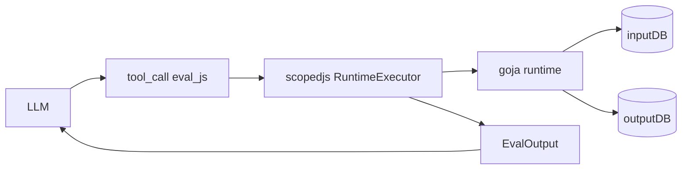
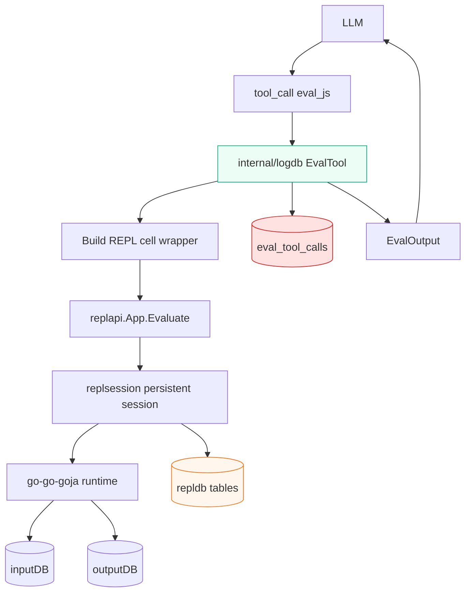
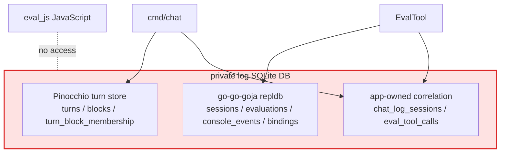
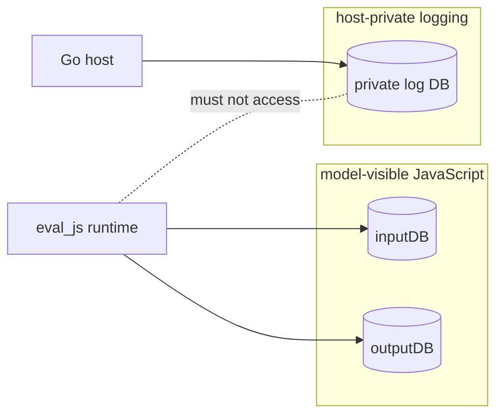
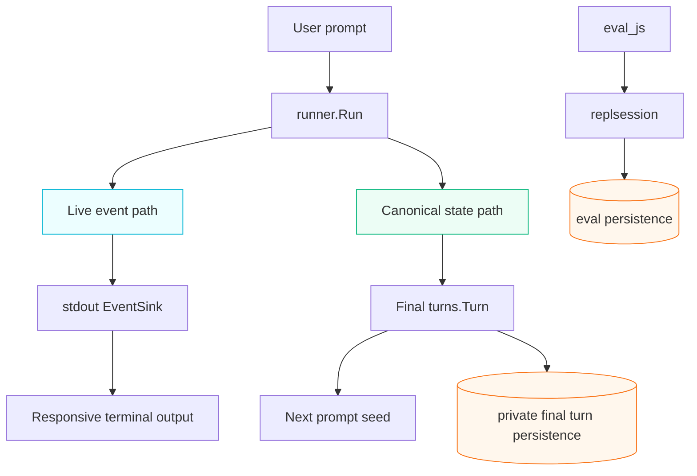

# From `eval_js` to a Persistent Agent Runtime: replsession Logging and Streaming Events

The first article, [[ARTICLE - Building a Tool-Using Go Chat Agent - Geppetto Goja and Glazed]], described the first working version of the `chat` agent: a small Go REPL that uses Geppetto for inference, Pinocchio for profile resolution, Glazed for embedded help, and go-go-goja for one model-facing JavaScript tool called `eval_js`. That version proved the basic loop. The model could inspect a local help database by writing JavaScript, run SQL against `inputDB`, store scratch state in `outputDB`, and answer the user from those results.

This follow-up is about the next turn in the design. Once a tool-using agent works, the obvious next question is: **how do we observe, persist, replay, and stream it without turning the agent into a pile of ad hoc logs?** The answer in this project is to move `eval_js` execution into go-go-goja's persistent REPL session machinery, store turn and eval history in a private SQLite database, and use Geppetto event sinks for live stdout streaming.

> [!summary]
> - The original `eval_js` tool executed JavaScript directly through a scoped runtime. The follow-up replaces that with a persistent `replapi.App` / `replsession` eval session.
> - A third SQLite database is now host-private. It stores final Geppetto turns, go-go-goja eval history, and app-owned correlation rows linking chat sessions to repl cells.
> - A live smoke test revealed a subtle bug: `replsession.ExecutionReport.Result` is a human preview, not a structured transport. The fix stores exact JSON in a known runtime global and reads it back through `replapi.WithRuntime`.
> - Streaming stdout should be built as a display-only `events.EventSink` attached to `runner.StartRequest.EventSinks`. It should not become the source of durable state.

## Why this note exists

The first version of the chat agent had the right shape for a demo, but not yet the right shape for an instrumented tool-using runtime. It could answer questions, and it could show tool calls after the fact, but it did not preserve a durable history of how those answers were produced. The JavaScript runtime was useful, but each tool call was still conceptually just a host function invocation. There was no first-class REPL session history behind it.

That difference matters. A model-generated JavaScript cell is not just a function call. It is evidence. It may query local docs, derive a result, mutate scratch state, log intermediate output, or fail in a way that teaches us something about the tool contract. If we throw away the structure of that execution and keep only a stringified tool result, we lose most of what makes the agent debuggable.

The second reason for this note is streaming. The current `chat` command still waits for `runner.Run` to complete and then prints the final turn. That is simple, but it makes the terminal feel frozen during long inference or tool execution. Geppetto already emits streaming events. The command just needs to attach a stdout sink and decide how to reconcile streamed text with final transcript printing.

The two improvements are connected by one rule: **separate observation from canonical state.** The private database stores canonical run artifacts at clear boundaries. Streaming events make the terminal responsive, but they are not the final conversation state. `replsession` owns JavaScript execution history, while Geppetto turns own conversation history.

## Repository and ticket map

The work described here lives in the same repo as the first article:

```text
/home/manuel/code/wesen/2026-04-29--go-go-agent
```

The two main tickets are:

```text
ttmp/2026/04/29/CHAT-THIRD-DB-LOGGING--design-third-private-sqlite-logging-database-for-chat-agent-turns-and-eval-js-persistence

ttmp/2026/04/29/CHAT-STREAMING-STDOUT--add-streaming-stdout-output-to-chat-repl
```

The main code files are:

| File | Role |
|---|---|
| `/home/manuel/code/wesen/2026-04-29--go-go-agent/cmd/chat/main.go` | Chat CLI, REPL loop, profile resolution, DB lifecycle, runner invocation, future streaming sink attachment point. |
| `/home/manuel/code/wesen/2026-04-29--go-go-agent/internal/evaljs/runtime.go` | Model-facing `eval_js` tool registration and go-go-goja runtime factory construction. |
| `/home/manuel/code/wesen/2026-04-29--go-go-agent/internal/logdb/logdb.go` | Private log DB lifecycle: one SQLite path, Pinocchio turn store, repldb store, replapi app, app-owned correlation tables. |
| `/home/manuel/code/wesen/2026-04-29--go-go-agent/internal/logdb/eval_tool.go` | replapi-backed implementation of the `eval_js` tool. |
| `/home/manuel/code/wesen/2026-04-29--go-go-agent/internal/logdb/turn_persister.go` | Geppetto final-turn persister and optional snapshot hook adapter. |
| `/home/manuel/code/wesen/corporate-headquarters/geppetto/pkg/inference/runner/types.go` | `runner.StartRequest`, including `EventSinks`, `SnapshotHook`, and `Persister`. |
| `/home/manuel/code/wesen/corporate-headquarters/geppetto/pkg/events/sink.go` | `events.EventSink` interface for streaming output. |
| `/home/manuel/code/wesen/corporate-headquarters/geppetto/pkg/events/chat-events.go` | Event types such as `partial`, `tool-call`, `tool-call-execute`, and `tool-call-execution-result`. |

## The old mental model: `eval_js` as a scoped function

In the first prototype, `eval_js` was conceptually a function registered into Geppetto's tool registry. The model would emit a tool call like this:

```json
{
  "code": "const rows = inputDB.query(\"SELECT slug, title FROM docs LIMIT 3\"); return rows;"
}
```

The host would pass that code to a scoped JavaScript executor. The executor would run the code inside a goja runtime that had two globals:

- `inputDB`, a read-only SQLite facade over embedded help entries
- `outputDB`, a writable scratch SQLite facade

That design was intentionally narrow. It let the model perform useful local computation without giving it a shell, filesystem access, or arbitrary host APIs.

The simplified old path looked like this:



The limitation is that the execution was not a persistent REPL session in the go-go-goja sense. We could see the tool result in the final turn, but we did not get the full REPL persistence model:

- durable eval cells,
- source and rewritten source,
- console events,
- binding versions,
- binding docs,
- restore/replay hooks,
- history/export APIs.

For a one-off tool call, that is fine. For a tool-using agent that we want to debug over time, it is not enough.

## The new mental model: `eval_js` as a persistent REPL cell

The improved design treats every `eval_js` call as a cell in a persistent go-go-goja REPL session. The model still sees the same rough tool contract: provide JavaScript code and optional input, receive a structured result or error. But internally, the host no longer executes the code through a direct scoped executor. It builds a REPL cell source, sends it to `replapi.App.Evaluate`, and lets `replsession` own execution and persistence.



This is not merely a logging change. It changes ownership. The REPL session becomes the execution engine for `eval_js`. The chat app no longer pretends to understand all the details of JavaScript execution history. It delegates that to the subsystem built for exactly that purpose.

The current implementation makes that boundary visible in code:

```go
// internal/logdb/eval_tool.go
func (e *EvalTool) Eval(ctx context.Context, in scopedjs.EvalInput) (scopedjs.EvalOutput, error) {
    source, err := buildEvalCellSource(in)
    if err != nil {
        return scopedjs.EvalOutput{Error: err.Error()}, nil
    }

    resp, evalErr := e.DB.ReplApp.Evaluate(ctx, e.DB.EvalSessionID, source)
    resultJSON, resultErr := e.readLastResultJSON(ctx, evalErr)
    out := convertReplResponseToEvalOutput(resp, evalErr, resultJSON, resultErr, started)

    _ = e.DB.insertEvalToolCall(ctx, EvalCorrelation{...})
    return out, nil
}
```

The visible structure is important:

1. Build a REPL cell source from the model's tool input.
2. Evaluate it through `replapi.App`.
3. Convert the REPL response back into the model-facing tool result.
4. Insert an app-owned correlation row.

The app does not manually insert repldb `EvaluationRecord` rows. That would recreate a parallel persistence implementation and miss the point of using `replsession`.

## The private database: one file, three families of tables

The private log database is deliberately not exposed to JavaScript. It is a host-only SQLite file used for debugging, replay, and post-run inspection. It is opened by `internal/logdb.Open` and combines three table families.



The lifecycle is in `internal/logdb/logdb.go`:

```go
func Open(ctx context.Context, cfg Config, factory *engine.Factory) (*DB, error) {
    turnStore, err := chatstore.NewSQLiteTurnStore(path)
    replStore, err := repldb.Open(ctx, path)
    migrateAppTables(ctx, replStore.DB())

    replApp, err := replapi.New(
        factory,
        log.Logger,
        replapi.WithProfile(replapi.ProfilePersistent),
        replapi.WithStore(replStore),
    )

    evalSessionID := chatSessionID + ":eval_js"
    evalSession, err := replApp.CreateSessionWithOptions(ctx, replapi.SessionOverrides{ID: evalSessionID})

    db := &DB{...}
    db.recordChatLogSession(ctx, cfg)
    return db, nil
}
```

The important thing to notice is that `Open` requires a go-go-goja `engine.Factory`. That factory is built from the JavaScript-visible scope: `inputDB` and `outputDB`. It must not include the private log database. The private database owns the REPL session, but the REPL runtime still receives only the globals intended for the model.

This is the security boundary:



## Why the correlation tables exist

`repldb` knows about REPL sessions and eval cells. Pinocchio's turn store knows about turns and blocks. Neither of those upstream schemas knows that this application has a chat session, a model tool call, and an `eval_js` tool invocation that should be related.

That is why the app owns two small tables:

```sql
CREATE TABLE IF NOT EXISTS chat_log_sessions (
  chat_session_id TEXT PRIMARY KEY,
  eval_session_id TEXT NOT NULL,
  conv_id TEXT NOT NULL,
  profile TEXT NOT NULL DEFAULT '',
  log_db_path TEXT NOT NULL DEFAULT '',
  started_at_ms INTEGER NOT NULL,
  ended_at_ms INTEGER,
  strict INTEGER NOT NULL DEFAULT 0,
  log_schema_version INTEGER NOT NULL DEFAULT 1
);

CREATE TABLE IF NOT EXISTS eval_tool_calls (
  eval_tool_call_id INTEGER PRIMARY KEY AUTOINCREMENT,
  tool_call_id TEXT NOT NULL DEFAULT '',
  chat_session_id TEXT NOT NULL,
  turn_id TEXT NOT NULL DEFAULT '',
  eval_session_id TEXT NOT NULL,
  repl_cell_id INTEGER,
  created_at_ms INTEGER NOT NULL,
  code TEXT NOT NULL,
  input_json TEXT NOT NULL DEFAULT '{}',
  eval_output_json TEXT NOT NULL DEFAULT '{}',
  error_text TEXT NOT NULL DEFAULT '',
  FOREIGN KEY(chat_session_id) REFERENCES chat_log_sessions(chat_session_id)
);
```

The correlation row is intentionally redundant. It stores source code and output JSON even though repldb also stores detailed evaluation reports. That is not because repldb is insufficient. It is because this table is an index into the cross-domain story:

- Which chat session was running?
- Which eval session executed JavaScript?
- Which repl cell contains the detailed REPL history?
- Which model-generated code was responsible?
- What did the model receive as the tool result?

A debugging query can start from `eval_tool_calls`, jump into `evaluations`, and then inspect turn blocks around the same time.

## Final turns vs intermediate snapshots

The private log database initially persisted every tool-loop snapshot: `pre_inference`, `post_inference`, `post_tools`, and `final`. That was useful for debugging the tool loop, but it produced a large number of rows in `turn_block_membership` because that table records one row per block per saved snapshot.

A live run with two prompts showed this clearly. There were only 13 distinct blocks, but 86 membership rows. That was not a bug. It was the schema doing exactly what it was designed to do: recording the membership of every block in every saved snapshot.

For current needs, final turns are enough. The command now persists final turns by default through the runner's `Persister`, while intermediate snapshots are opt-in:

```text
--log-db-turn-snapshots
```

The request construction now has this shape:

```go
if logDB != nil {
    req.SessionID = logDB.ChatSessionID
    if logDBTurnSnapshots {
        req.SnapshotHook = logDB.SnapshotHook()
    }
    req.Persister = logDB.TurnPersister()
}
```

A final-only live run confirmed the new behavior:

```text
turns|1
blocks|6
membership|6
evaluations|1
eval_tool_calls|1

phase counts:
final|6
```

The lesson is general: **snapshot logging should be explicit because snapshot tables multiply by both phase and block count.** Final state is the right default. Intermediate state is a debugging mode.

## The exact-result bug: when a preview pretends to be data

The most interesting failure in this work came from result conversion. The design initially assumed that `replsession.ExecutionReport.Result` could be parsed as the wrapper's JSON string. That worked in a unit test, but a live LLM smoke test failed.

The model called `eval_js` correctly:

```javascript
const rows = inputDB.query("SELECT slug, title FROM docs ORDER BY title LIMIT 3");
return rows;
```

The REPL evaluation itself succeeded, but the tool result returned to the model was an error:

```text
eval_js result was not valid JSON: invalid character 'â' after object key:value pair
```

The clue was the character. The `â` came from decoding a UTF-8 ellipsis as if it were part of JSON. `ExecutionReport.Result` was not the exact string returned by the JavaScript cell. It was a display preview, and the preview had been truncated:

```text
"{\"result\":[{\"title\":\"Database Globals API\",...}]…"
```

This is a classic instrumentation bug. A human-readable preview looks like data until it becomes just different enough to break a parser.

The fix is now explicit. The wrapper stores the exact JSON string in a known runtime global:

```javascript
const __chat_eval_input = /* input JSON */;
const __chat_eval_result = await (async function(input) {
  // model code here
})(__chat_eval_input);
globalThis.__chat_eval_last_json = JSON.stringify({ result: __chat_eval_result });
globalThis.__chat_eval_last_json;
```

After `replapi.App.Evaluate` returns, Go reads that exact global from the live runtime:

```go
func (e *EvalTool) readLastResultJSON(ctx context.Context, evalErr error) (string, error) {
    if evalErr != nil {
        return "", nil
    }
    var resultJSON string
    err := e.DB.ReplApp.WithRuntime(ctx, e.DB.EvalSessionID, func(rt *gojengine.Runtime) error {
        v := rt.VM.Get("__chat_eval_last_json")
        if v == nil || goja.IsUndefined(v) || goja.IsNull(v) {
            return fmt.Errorf("eval_js did not set __chat_eval_last_json")
        }
        resultJSON = v.String()
        return nil
    })
    return resultJSON, err
}
```

This preserves the architecture. `replsession` still executes and persists the cell. The app does not insert fake eval rows. The only extra convention is a known global used to transfer the exact structured result back to the tool adapter.

The deeper rule is this: **do not parse display previews as data.** If an API field is meant for humans, it can be truncated, decorated, rounded, escaped, or localized. Structured transport needs an explicit channel.

## Live proof after the fix

The fixed live tmux run used:

```bash
go run ./cmd/chat \
  --profile gpt-5-nano-low \
  --log-db /tmp/chat-log-live-fixed.sqlite \
  --log-db-keep-temp
```

The model was asked to list the first three embedded help entries. The tool result was correct:

```json
{
  "result": [
    {"slug":"database-globals-api","title":"Database Globals API"},
    {"slug":"chat-repl-user-guide","title":"chat REPL User Guide"},
    {"slug":"eval-js-api","title":"eval_js Tool API"}
  ]
}
```

A second prompt asked the model to write and read `outputDB`:

```json
{
  "result": {
    "noteRow": {"key":"live-smoke","value":"ok"},
    "schemaInfo": {"Name":"outputDB","Readonly":false,"Tables":["notes"]}
  },
  "durationMs": 3
}
```

The private DB then contained the expected table families:

```text
binding_docs           chat_log_sessions      repldb_meta
binding_versions       console_events         sessions
bindings               eval_tool_calls        turn_block_membership
blocks                 evaluations            turns
```

And the counts after two prompts were:

```text
chat_log_sessions|1
turns|2
blocks|13
turn_block_membership|86
sessions|1
evaluations|2
console_events|0
bindings|3
binding_versions|5
binding_docs|0
eval_tool_calls|2
```

The count that matters most is not any single row count. It is the shape:

- final turns are persisted,
- eval cells are persisted,
- correlation rows connect chat/eval domains,
- JavaScript-visible DBs still work,
- the private log DB stays private.

## The streaming events plan

The next improvement is stdout streaming. The current REPL still waits until `runner.Run` returns and then prints the whole final turn. That means the user does not see partial assistant output or tool progress while the run is happening.

Geppetto already has the mechanism we need. `runner.StartRequest` accepts event sinks:

```go
type StartRequest struct {
    SessionID string
    Prompt    string
    SeedTurn  *turns.Turn
    Runtime   Runtime

    EventSinks   []events.EventSink
    SnapshotHook toolloop.SnapshotHook
    Persister    enginebuilder.TurnPersister
}
```

The sink interface is small:

```go
type EventSink interface {
    PublishEvent(event Event) error
}
```

The runner flows it through `Prepare` into `enginebuilder.Builder`, and the builder attaches it to the run context:

```go
if len(r.eventSinks) > 0 {
    runCtx = events.WithEventSinks(runCtx, r.eventSinks...)
}
```

Provider engines publish events into that context:

```go
events.PublishEventToContext(ctx, event)
```

This is the right abstraction. The chat command should not know how OpenAI, Claude, or Gemini stream tokens. It should implement a sink that knows how to render Geppetto events.

## Streaming as a display path, not a state path

The first design rule for streaming is the same as the logging rule: keep observation separate from state. Streaming events are partial. They can arrive before the final message is known. They can be superseded. They can include provider-specific progress events. They are perfect for a terminal display, but they are not the canonical conversation.



The terminal sink should be able to fail without corrupting the conversation. The final turn should still be the thing that updates the seed. The private DB should still persist final turns and eval records, not partial stdout fragments.

## What events should stdout care about?

The Geppetto event package has many event types. A good first stdout sink should handle only the common user-facing subset.

| Event type | Go type | What it means | Default stdout behavior |
|---|---|---|---|
| `partial` | `*events.EventPartialCompletion` | Assistant text delta. | Print `Delta` directly. |
| `partial-thinking` | `*events.EventThinkingPartial` | Reasoning/thinking delta. | Suppress by default. |
| `tool-call` | `*events.EventToolCall` | Provider requested a tool call. | Print a short tool banner. |
| `tool-call-execute` | `*events.EventToolCallExecute` | Host is about to run a tool. | Print `[tool eval_js running]`. |
| `tool-call-execution-result` | `*events.EventToolCallExecutionResult` | Host finished running a tool. | Print `[tool eval_js done]` or error. |
| `error` | `*events.EventError` | Error emitted during inference. | Print a visible error line. |
| `info` / `log` | `*events.EventInfo`, `*events.EventLog` | Progress/log events. | Suppress unless verbose mode is enabled. |

The stdout sink should not dump every tool result by default. Tool results can be very large JSON objects. The final transcript and the private log DB can preserve detail. The live terminal should remain readable.

A good first UX looks like this:

```text
> Use eval_js to list the first help entry.

assistant: Let me check the embedded help database.

[tool eval_js call call_123]
[tool eval_js done]
The first entry is database-globals-api — Database Globals API.
>
```

## Pseudocode for the stdout sink

The sink is a small stateful writer. It needs a mutex because event sinks may be invoked from inference goroutines, and it tracks formatting state such as whether the assistant line has started.

```go
type stdoutStreamSink struct {
    mu sync.Mutex

    out    io.Writer
    errOut io.Writer

    assistantStarted bool
    lastWasDelta     bool

    showToolArgs    bool
    showToolResults bool
}

func (s *stdoutStreamSink) PublishEvent(event events.Event) error {
    s.mu.Lock()
    defer s.mu.Unlock()

    switch e := event.(type) {
    case *events.EventPartialCompletion:
        return s.writeDelta(e.Delta)
    case *events.EventToolCall:
        return s.writeToolCall(e.ToolCall)
    case *events.EventToolCallExecute:
        return s.writeToolExecute(e.ToolCall)
    case *events.EventToolCallExecutionResult:
        return s.writeToolResult(e.ToolResult)
    case *events.EventError:
        return s.writeError(e)
    default:
        return nil
    }
}
```

Delta output should be direct:

```go
func (s *stdoutStreamSink) writeDelta(delta string) error {
    if delta == "" {
        return nil
    }
    if !s.assistantStarted {
        fmt.Fprint(s.out, "\nassistant: ")
        s.assistantStarted = true
    }
    _, err := fmt.Fprint(s.out, delta)
    s.lastWasDelta = true
    return err
}
```

Tool banners should start on a clean line:

```go
func (s *stdoutStreamSink) writeToolCall(tc events.ToolCall) error {
    s.ensureLineBreak()
    _, err := fmt.Fprintf(s.out, "\n[tool %s call %s]\n", tc.Name, tc.ID)
    return err
}
```

This is enough to make the terminal feel alive without turning it into an event log.

## How `runPrompt` should change for streaming

The current `runPrompt` decides only one output moment: after `runner.Run` returns. With streaming, it needs to decide two moments:

1. whether to attach a live sink before the run,
2. whether to print the full final turn after the run.

The clean shape is:

```go
func runPrompt(..., stream bool, printFinalTurn bool, out io.Writer, errOut io.Writer) error {
    req := runner.StartRequest{
        SeedTurn: seed,
        Prompt:   prompt,
        Runtime:  runtime,
    }

    if stream {
        req.EventSinks = append(req.EventSinks, newStdoutStreamSink(out, errOut, stdoutStreamOptions{}))
    }

    if logDB != nil {
        req.SessionID = logDB.ChatSessionID
        if logDBTurnSnapshots {
            req.SnapshotHook = logDB.SnapshotHook()
        }
        req.Persister = logDB.TurnPersister()
    }

    _, updated, err := r.Run(ctx, req)
    if err != nil {
        return err
    }

    if stream {
        fmt.Fprintln(out)
    }
    if !stream || printFinalTurn {
        fmt.Fprintln(out)
        turns.FprintfTurn(out, updated, turns.WithToolDetail(true))
        fmt.Fprintln(out)
    }

    *seed = *updated.Clone()
    return nil
}
```

This avoids the most common mistake: printing streamed assistant text and then printing the whole final turn, which duplicates the assistant answer.

## Recommended CLI flags for streaming

A first implementation should probably use these flags:

```text
--stream             Stream assistant/tool progress to stdout while inference runs.
--print-final-turn   Print the full final turn after completion, even when streaming.
```

The default deserves a small design decision. In an interactive REPL, streaming should probably be on. In one-shot script mode, stable full-turn output may be more important. There are two reasonable defaults:

| Default | Pros | Cons |
|---|---|---|
| `--stream=true` everywhere | Best interactive experience, satisfies the ticket directly. | Script output changes unless users pass `--stream=false`. |
| `--stream=true` only in REPL, false for one-shot args | Better script compatibility. | Slightly more logic in `run`. |

My recommendation is to default streaming on in the REPL and make one-shot behavior explicit. If the command is primarily an interactive chat tool, streaming is the expected UX. If it becomes a scripting tool, `--stream=false` can preserve machine-readable or full transcript output.

## Testing the streaming implementation

The test plan should match the two paths: event formatting and integrated command behavior.

First, test the sink with buffers:

```go
func TestStdoutStreamSinkPrintsDeltasAndToolSummaries(t *testing.T) {
    var out bytes.Buffer
    sink := newStdoutStreamSink(&out, io.Discard, stdoutStreamOptions{})

    _ = sink.PublishEvent(events.NewPartialCompletionEvent(events.EventMetadata{}, "Hello", "Hello"))
    _ = sink.PublishEvent(events.NewPartialCompletionEvent(events.EventMetadata{}, " world", "Hello world"))
    _ = sink.PublishEvent(events.NewToolCallEvent(events.EventMetadata{}, events.ToolCall{ID:"call-1", Name:"eval_js"}))

    got := out.String()
    require.Contains(t, got, "assistant: Hello world")
    require.Contains(t, got, "[tool eval_js call call-1]")
}
```

Then test live behavior with tmux:

```bash
tmux new-session -d -s chat-stream-smoke -c /home/manuel/code/wesen/2026-04-29--go-go-agent 'bash'
tmux send-keys -t chat-stream-smoke 'go run ./cmd/chat --profile gpt-5-nano-low --log-db /tmp/chat-stream.sqlite --log-db-keep-temp --stream' C-m
tmux send-keys -t chat-stream-smoke 'Use eval_js to list the first three embedded help entries.' C-m
```

The validation criteria are concrete:

- assistant text appears before the run is complete,
- tool calls produce compact progress lines,
- the prompt returns cleanly after completion,
- the private DB still contains final turns and eval rows,
- final turn printing does not duplicate the streamed answer unless `--print-final-turn` is set.

## Implementation sequence

The safe sequence is:

1. Add `cmd/chat/stream_stdout.go` with a small `events.EventSink` implementation.
2. Add tests for formatting deltas, tool calls, tool results, and errors.
3. Add `StreamStdout` and `PrintFinalTurn` settings.
4. Add `--stream` and `--print-final-turn` flags.
5. Pass `errOut` into `runPrompt` so errors can be written separately.
6. Attach the sink to `runner.StartRequest.EventSinks` only when streaming is enabled.
7. Suppress final full-turn printing when streaming is enabled unless `--print-final-turn` is set.
8. Run `go test ./... -count=1`.
9. Run a live tmux smoke test.
10. Save evidence in the ticket and update the diary.

This is deliberately incremental. The sink can be reviewed independently from the CLI flag behavior, and the CLI behavior can be tested before a live provider run.

## What this teaches about agent engineering

The important lesson is that a tool-using agent has at least three histories:

1. The conversation history: what user and assistant messages, tool calls, and tool results make up the turn.
2. The tool execution history: what code ran, what it printed, what bindings changed, and what result it returned.
3. The live experience history: what the user saw while the run was happening.

It is tempting to collapse these histories into one log. That works for a prototype but becomes confusing quickly. A streamed token is not the same kind of artifact as a final assistant message. A REPL cell is not the same kind of artifact as a model tool-call block. A correlation row is not the same as either; it is the bridge between them.

The improved chat agent keeps those histories separate:

- Geppetto turns preserve conversation state.
- replsession preserves JavaScript execution state.
- app-owned correlation tables connect the two.
- event sinks provide live display.

That separation is what makes the system extensible. We can add streaming without changing eval persistence. We can improve eval replay without changing stdout. We can decide whether to persist intermediate turn snapshots without affecting the model-facing tool contract.

## Open questions

Several decisions remain open and should be revisited during implementation:

- Should `--stream` default to true in both REPL and one-shot modes?
- Should `--print-final-turn` default to true when `--stream=false`?
- Should tool result previews be hidden by default or truncated to a small number of characters?
- Should reasoning deltas ever be displayed, and if so under a separate explicit flag?
- Should the `__chat_eval_last_json` runtime global be cleared before each eval to guard against stale values after unusual failures?
- Should tool-call IDs be propagated into the eval correlation row by customizing the Geppetto tool executor context?

## Near-term next steps

For the replsession path:

- Add a regression test for long structured results to prove the exact-result global avoids preview truncation.
- Consider clearing `globalThis.__chat_eval_last_json` at the start of every wrapper cell.
- Decide the final semantics of `--no-log-db`, which currently conflicts with mandatory replapi-backed `eval_js` persistence.

For streaming stdout:

- Implement the stdout sink.
- Add `--stream` and `--print-final-turn` flags.
- Run a live tmux smoke test and save evidence.
- Verify private DB logging still writes final turns and eval rows.

## Closing thought

The first article showed how to build a useful tool-using Go agent. This follow-up shows the next layer: making that agent observable enough to trust. A tool call is no longer just a blob in a transcript. It is a REPL cell with history. A chat turn is no longer just terminal output. It is a persisted final state. Streaming output will make the terminal responsive, but it will remain display-only.

That is the shape worth preserving: **responsive at the edges, durable at the boundaries, and explicit about which subsystem owns which kind of truth.**
