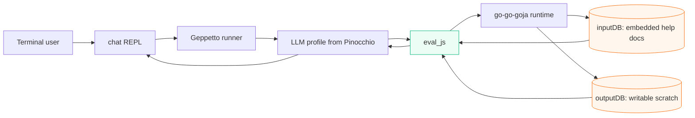
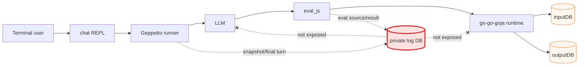
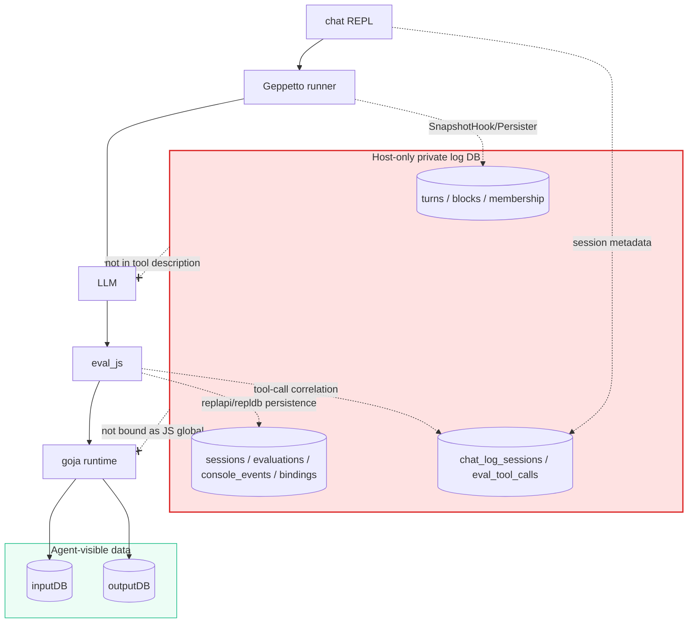
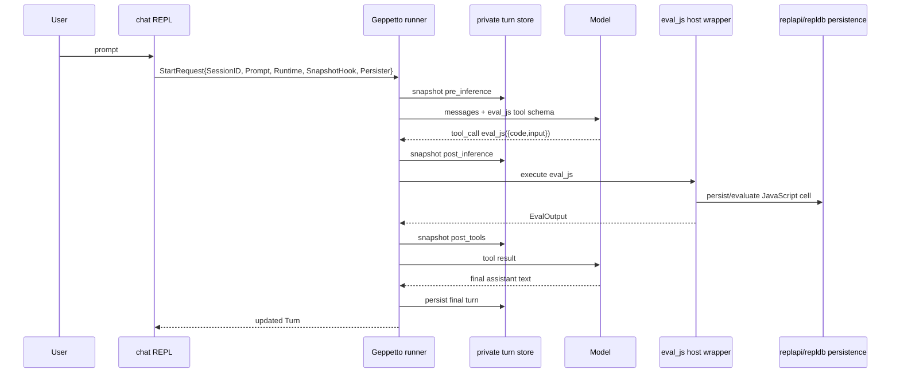

# Private logging database for chat agent turns and eval_js execution

## Executive summary

The current `chat` prototype has two SQLite databases visible to the JavaScript runtime:

1. `inputDB`: read-only, model-accessible, populated from help entries embedded in the `chat` binary.
2. `outputDB`: writable scratch, model-accessible, used by JavaScript for derived notes and temporary data.

This ticket designs a **third SQLite database** that is deliberately **not accessible to the agent**. The model must not be able to query it through `inputDB`, write to it through `outputDB`, or reach it from `eval_js`. The third database is host-owned audit/debug infrastructure.

The third DB should log two categories of data:

1. **Session turns**: the Geppetto/Pinocchio `turns.Turn` snapshots generated during the chat REPL, including user messages, tool calls, tool results, and assistant messages.
2. **Evaluated JavaScript data**: each `eval_js` call's source/input/output/error/console/runtime details, using the go-go-goja REPL persistence model (`replapi`, `replsession`, and `repldb`) rather than inventing a custom ad hoc eval-log schema.

The recommended implementation is a private `internal/logdb` package that opens one SQLite file and initializes two families of tables in it:

- Pinocchio chatstore tables for normalized turn snapshots: `turns`, `blocks`, and `turn_block_membership`.
- go-go-goja REPL persistence tables for JavaScript evaluation history: `sessions`, `evaluations`, `console_events`, `bindings`, `binding_versions`, and `binding_docs`.

The host app then wires this private DB into Geppetto's existing persistence hooks:

- use `runner.StartRequest.Persister` / `enginebuilder.TurnPersister` for the final turn,
- use `runner.StartRequest.SnapshotHook` / `toolloop.SnapshotHook` for intermediate phases such as `pre_inference`, `post_inference`, and `post_tools`,
- use a `replapi.App` / `replsession`-backed `eval_js` implementation so every JavaScript execution is persisted by the REPL session itself.

The important security boundary is simple: **the private log DB path and handle never enter `evaljs.Scope`, never become a `jsdb.Facade`, and never appear in the model-facing tool description.**

## Current system recap

The current `chat` app is implemented in `/home/manuel/code/wesen/2026-04-29--go-go-agent`.

Important current files:

| File | Current role |
|---|---|
| `cmd/chat/main.go` | CLI root, Glazed logging/help initialization, Pinocchio profile resolution, Geppetto runner call, REPL loop, turn printing. |
| `internal/helpdocs/docs.go` | Embeds Markdown help entries and registers them with a Glazed `HelpSystem`. |
| `internal/helpdb/helpdb.go` | Materializes embedded help into `inputDB`; creates `docs` compatibility view; creates writable `outputDB` scratch DB. |
| `internal/jsdb/facade.go` | Binds `query`, `exec`, and `schema` methods to JavaScript objects. |
| `internal/evaljs/runtime.go` | Registers the `eval_js` tool and should delegate execution to the replapi-backed host tool. |

Current runtime shape:



The third database adds a host-only observer path:



## Requirements and non-requirements

### Requirements

The implementation should:

- Add a third SQLite DB, for example via `--log-db path` or a default temp/app-data path.
- Keep the log DB private to Go host code.
- Persist session turns from Geppetto/Pinocchio.
- Persist `eval_js` executions using the go-go-goja REPL persistence schema and APIs where possible.
- Correlate turns and eval cells by chat session ID, turn ID, tool call ID, and eval session ID.
- Preserve enough data for post-run inspection:
  - user prompts,
  - assistant responses,
  - tool call names/arguments,
  - tool results/errors,
  - JavaScript source,
  - JavaScript input object,
  - console output,
  - eval output/error,
  - runtime diffs/bindings if using full `replapi` persistent sessions.
- Include indexes or query views useful for debugging.
- Be resilient: logging failures should not crash an otherwise successful chat unless the user opts into strict logging.

### Non-requirements for version 1

The implementation does not need to:

- expose the log DB to `eval_js`, `inputDB`, or `outputDB`,
- build a UI for browsing logs,
- support multi-process concurrent writers beyond SQLite's normal WAL behavior,
- persist encrypted provider reasoning in a special format beyond turn serialization,
- implement external help ingestion,
- replace the current `inputDB` and `outputDB` behavior.

## Existing evidence and APIs

### Geppetto runner persistence hooks

Geppetto's `enginebuilder.Builder` defines a `TurnPersister` interface:

```go
type TurnPersister interface {
    PersistTurn(ctx context.Context, t *turns.Turn) error
}
```

The builder comments say the persister is invoked on successful completion when a final updated turn exists. It also expects session correlation to be present in `Turn.Metadata` via `turns.KeyTurnMetaSessionID`.

The runner's `StartRequest` includes both:

```go
type StartRequest struct {
    SessionID string
    Prompt    string
    SeedTurn  *turns.Turn
    Runtime   Runtime

    EventSinks   []events.EventSink
    SnapshotHook toolloop.SnapshotHook
    Persister    enginebuilder.TurnPersister
}
```

This means the `chat` app does not need to fork Geppetto to persist turns. It can pass a `Persister` into each run request.

Geppetto's tool loop also supports snapshots. `toolloop.Loop` calls a snapshot hook at phases such as:

- `pre_inference`
- `post_inference`
- `post_tools`

The snapshot hook type is:

```go
type SnapshotHook func(ctx context.Context, t *turns.Turn, phase string)
```

For a debugging database, this is more useful than only final persistence because it captures the tool-call loop as it evolves.

### Pinocchio SQLite turn store

Pinocchio already has a normalized SQLite turn store in `pkg/persistence/chatstore`.

The `TurnStore` interface is:

```go
type TurnStore interface {
    Save(ctx context.Context, convID, sessionID, turnID, phase string, createdAtMs int64, payload string, opts TurnSaveOptions) error
    List(ctx context.Context, q TurnQuery) ([]TurnSnapshot, error)
    Close() error
}
```

The SQLite implementation creates:

- `turns`
- `blocks`
- `turn_block_membership`

The `Save` method expects a serialized YAML turn payload. It parses it with Geppetto's turn serde layer, then normalizes the turn and blocks into relational tables. This is important: the store is not just a blob dump. It projects blocks into queryable rows and hashes block content.

The Geppetto serializer is available at `github.com/go-go-golems/geppetto/pkg/turns/serde`:

```go
func ToYAML(t *turns.Turn, opt Options) ([]byte, error)
func FromYAML(b []byte) (*turns.Turn, error)
```

### go-go-goja REPL persistence

go-go-goja's REPL API has a durable persistence layer split across:

- `pkg/replapi`: app/session facade,
- `pkg/replsession`: evaluation service and policy,
- `pkg/repldb`: SQLite store and schema.

`replapi.App` exposes:

```go
func (a *App) CreateSession(ctx context.Context) (*replsession.SessionSummary, error)
func (a *App) Evaluate(ctx context.Context, sessionID string, source string) (*replsession.EvaluateResponse, error)
func (a *App) History(ctx context.Context, sessionID string) ([]repldb.EvaluationRecord, error)
func (a *App) Export(ctx context.Context, sessionID string) (*repldb.SessionExport, error)
```

The persistent profile enables durable evaluation/session data:

```go
func PersistentConfig(store *repldb.Store) Config
func WithProfile(profile Profile) Option
func WithStore(store *repldb.Store) Option
```

The persistent policy writes evaluations, binding versions, and binding docs:

```go
PersistPolicy{
    Enabled:         true,
    Evaluations:     true,
    BindingVersions: true,
    BindingDocs:     true,
}
```

The repldb schema includes:

- `sessions`
- `evaluations`
- `console_events`
- `bindings`
- `binding_versions`
- `binding_docs`

This is a strong fit for logging evaluated JavaScript data because it already stores raw source, rewritten source, execution result, error text, static analysis JSON, globals-before/after JSON, console events, binding versions, and JSDoc-derived binding docs.

## Proposed architecture

### One private SQLite file, multiple schemas

Use one third SQLite file for all private logging data. For example:

```text
chat-log.sqlite
```

Initialize it with both existing persistence packages:

```go
turnStore, err := chatstore.NewSQLiteTurnStore(logDBPath)
replStore, err := repldb.Open(ctx, logDBPath)
```

Both packages create their own tables. Their table names do not conflict:

- Pinocchio chatstore tables: `turns`, `blocks`, `turn_block_membership`
- go-go-goja repldb tables: `repldb_meta`, `sessions`, `evaluations`, `console_events`, `bindings`, `binding_versions`, `binding_docs`

Then add a small app-owned schema for correlation metadata:

```sql
CREATE TABLE IF NOT EXISTS chat_log_sessions (
  chat_session_id TEXT PRIMARY KEY,
  eval_session_id TEXT NOT NULL,
  conv_id TEXT NOT NULL,
  profile TEXT NOT NULL DEFAULT '',
  started_at_ms INTEGER NOT NULL,
  log_schema_version INTEGER NOT NULL DEFAULT 1
);

CREATE TABLE IF NOT EXISTS eval_tool_calls (
  tool_call_id TEXT PRIMARY KEY,
  chat_session_id TEXT NOT NULL,
  turn_id TEXT NOT NULL DEFAULT '',
  eval_session_id TEXT NOT NULL,
  repl_cell_id INTEGER,
  created_at_ms INTEGER NOT NULL,
  code TEXT NOT NULL,
  input_json TEXT NOT NULL DEFAULT '{}',
  eval_output_json TEXT NOT NULL DEFAULT '{}',
  error_text TEXT NOT NULL DEFAULT '',
  FOREIGN KEY(chat_session_id) REFERENCES chat_log_sessions(chat_session_id)
);

CREATE INDEX IF NOT EXISTS eval_tool_calls_by_session_created
  ON eval_tool_calls(chat_session_id, created_at_ms DESC);

CREATE INDEX IF NOT EXISTS eval_tool_calls_by_turn
  ON eval_tool_calls(turn_id);
```

The custom `eval_tool_calls` table is not a replacement for repldb. It is a correlation table. The detailed eval data should still live in repldb's `evaluations` and child tables.

### Component diagram



### Data flow per REPL prompt



## Implementation design

### New package: `internal/logdb`

Add a package that owns the private logging DB lifecycle.

Suggested files:

```text
internal/logdb/
  logdb.go              # Open/Close, config, schema, session setup
  turn_persister.go     # Geppetto TurnPersister + SnapshotHook adapter
  eval_persistence.go   # replapi/repldb eval persistence adapter
  queries.go            # optional inspection helpers for tests/debug
  logdb_test.go
```

Core types:

```go
type Config struct {
    Path          string
    Strict        bool // if true, logging failures fail the chat run
    Profile       string
    ChatSessionID string
}

type DB struct {
    Path          string
    SQL           *sql.DB // optional direct handle for app-owned tables
    TurnStore     *chatstore.SQLiteTurnStore
    ReplStore     *repldb.Store
    ReplApp       *replapi.App // required: eval_js executes through persistent replapi sessions
    ChatSessionID string
    EvalSessionID string
    ConvID         string
    Strict         bool
}
```

Opening the DB:

```go
func Open(ctx context.Context, cfg Config, factory *gojengine.Factory) (*DB, error) {
    path := resolveLogDBPath(cfg.Path)

    turnStore, err := chatstore.NewSQLiteTurnStore(path)
    if err != nil { return nil, err }

    replStore, err := repldb.Open(ctx, path)
    if err != nil { turnStore.Close(); return nil, err }

    sqlDB, err := sql.Open("sqlite3", path)
    if err != nil { closeBoth(); return nil, err }

    if err := migrateAppTables(ctx, sqlDB); err != nil { closeAll(); return nil, err }

    replApp, err := replapi.New(
        factory,
        log.Logger,
        replapi.WithProfile(replapi.ProfilePersistent),
        replapi.WithStore(replStore),
    )
    if err != nil { closeAll(); return nil, err }

    evalSession, err := replApp.CreateSessionWithOptions(ctx, replapi.SessionOverrides{
        ID: cfg.ChatSessionID + ":eval_js",
    })
    if err != nil { closeAll(); return nil, err }

    db := &DB{... EvalSessionID: evalSession.ID ...}
    if err := db.recordChatLogSession(ctx, cfg); err != nil { closeAll(); return nil, err }
    return db, nil
}
```

The `factory` parameter is required in v1. The private logging database does not merely observe `eval_js`; it owns the persistent REPL session that executes `eval_js`. There is no direct `scopedjs.RuntimeExecutor.RunEval` fallback and no compatibility path that writes synthetic `EvaluationRecord` rows by hand.

## How to persist eval_js executions

Version 1 uses one implementation mode: **replace the existing `eval_js` executor with a persistent `replapi.App` / `replsession` session**.

The eval tool must not call `scopedjs.RunEval` or directly call `repldb.Store.PersistEvaluation`. Instead, it should:

1. Factor the go-go-goja runtime factory construction so both the chat tool wrapper and `replapi` can create runtimes with the same model-visible globals.
2. Build a go-go-goja `engine.Factory` with only the intended JavaScript globals, such as `inputDB` and `outputDB`.
3. Create a `replapi.App` with `ProfilePersistent` and a `repldb.Store` opened on the private log DB.
4. Create one persistent eval session per chat session.
5. For every `eval_js` call, transform the tool input into a REPL cell source and call:
   ```go
   resp, err := replApp.Evaluate(ctx, evalSessionID, source)
   ```
6. Convert `resp` into the model-facing `EvalOutput` and insert one app-owned correlation row in `eval_tool_calls`.

### Required behavior change

This is an intentional replacement, not a compatibility layer:

- remove the old direct `scopedjs.RuntimeExecutor.RunEval` execution path from the chat tool,
- do not synthesize `repldb.EvaluationRecord` rows manually for `eval_js`,
- let `replsession` own evaluation, persistence, console capture, analysis, runtime snapshots, bindings, binding versions, and binding docs,
- keep the public `eval_js` tool contract stable only where it matters to the model: it still accepts code plus optional input and returns a structured result/error payload.

The implementation may keep the package name `internal/evaljs`, but its execution backend should be replapi-backed.

### REPL cell wrapper

The wrapper source should preserve the current model-facing authoring style where the model can write code that uses `input`, calls `inputDB`/`outputDB`, logs to console, and returns a value:

```javascript
const __chat_eval_input = /* JSON input */;
const __chat_eval_result = await (async function(input) {
  // model-provided code goes here, including `return rows;`
})(__chat_eval_input);
JSON.stringify({ result: __chat_eval_result });
```

For successful cells, parse the JSON string returned by the wrapper and place the decoded value into `EvalOutput.Result`.

For failed cells, convert the `replsession.EvaluateResponse`/error into `EvalOutput.Error` while still allowing replsession to persist the failed evaluation. The Go host function should normally return a successful tool response containing the error payload rather than surfacing a Go error to Geppetto, unless the failure is an infrastructure error such as database corruption, session loss, or context cancellation.

### Structured result conversion

`replsession.ExecutionReport.Result` is a display-oriented preview string. Do not rely on that preview as the only model-facing value.

Use an explicit JSON-return convention instead:

```javascript
const __chat_eval_result = await (async function(input) { ... })(__chat_eval_input);
JSON.stringify({ result: __chat_eval_result });
```

Then convert the response as follows:

1. If replapi reports successful execution and the result string is valid JSON with a `result` property, decode it into `EvalOutput.Result`.
2. If the wrapper's JSON serialization fails, return an `EvalOutput.Error` explaining that the returned value was not JSON-serializable.
3. If execution fails before the wrapper returns, fill `EvalOutput.Error` from the replsession execution error or host error.
4. Always insert the app-owned `eval_tool_calls` row with the source code, input JSON, eval session ID, repl cell ID if known, output JSON, and error text.

### Correlation row responsibilities

`replsession` persists the detailed eval record. The app-owned adapter only records the cross-domain correlation:

```go
type EvalCorrelation struct {
    ToolCallID     string
    ChatSessionID  string
    TurnID         string
    EvalSessionID  string
    ReplCellID     int64
    CreatedAtMs    int64
    Code           string
    InputJSON      json.RawMessage
    EvalOutputJSON json.RawMessage
    ErrorText      string
}
```

The missing piece may still be `ToolCallID`. Geppetto's generic tool executor may not currently place tool-call metadata into `context.Context` for the function call. If it does not, the v1 table keeps `tool_call_id` nullable/empty and postprocessing correlates by chat session, timestamp, source text, and tool-call block ordering.

### Why replapi/replsession is mandatory

Using replapi from the start gives the private DB the same durability and replay/debug semantics as go-go-goja's REPL:

- raw source and rewritten source are stored by replsession,
- console output is captured through the same machinery as the REPL,
- static analysis, runtime snapshots, bindings, binding versions, and docs are persisted according to the persistent policy,
- history/export/restore tooling can reuse go-go-goja infrastructure,
- the document no longer needs a future migration from synthetic eval records to true persistent REPL sessions.

The cost is a larger refactor now: runtime factory construction must be separated from the old scoped executor, and result conversion must be tested carefully. That cost is accepted for this design.

## Recommended version 1 path

Version 1 is replapi-backed only:

1. Build the JavaScript runtime through a factory that can be handed to `replapi.App`.
2. Execute every `eval_js` call through `replapi.App.Evaluate` in a persistent eval session.
3. Use `replsession`/`repldb` as the source of truth for evaluation history.
4. Add app-owned correlation tables for chat session, turn, tool call, eval session, and repl cell lookup.
5. Remove the direct scopedjs execution path for chat `eval_js`; do not maintain two execution backends.

Why this recommendation?

- The private DB should contain first-class REPL session history, not approximated eval records.
- Replay/restore/debug workflows are much simpler if evals were originally executed by replsession.
- Binding diffs, console capture, analysis, and source rewrites should come from the same code path used by go-go-goja's persistent REPL.
- Maintaining both scopedjs execution and replapi execution would create divergent behavior and double the test matrix.

## Turn persistence adapter

Implement an adapter from Geppetto's `TurnPersister` to Pinocchio's `TurnStore`.

```go
type TurnLogger struct {
    Store     chatstore.TurnStore
    ConvID    string
    SessionID string
    Strict    bool
}

func (l *TurnLogger) PersistTurn(ctx context.Context, t *turns.Turn) error {
    return l.SaveSnapshot(ctx, t, "final")
}

func (l *TurnLogger) SnapshotHook() toolloop.SnapshotHook {
    return func(ctx context.Context, t *turns.Turn, phase string) {
        err := l.SaveSnapshot(ctx, t, phase)
        if err != nil && l.Strict {
            // SnapshotHook cannot return an error, so strict mode should record
            // the error and let the caller check after the run.
        }
    }
}

func (l *TurnLogger) SaveSnapshot(ctx context.Context, t *turns.Turn, phase string) error {
    if t == nil { return nil }
    if t.ID == "" { t.ID = uuid.NewString() }

    sessionID := l.SessionID
    if sessionID == "" {
        sessionID = getTurnSessionID(t.Metadata)
    }
    if sessionID == "" {
        sessionID = "session"
    }

    payload, err := serde.ToYAML(t, serde.Options{})
    if err != nil { return err }

    return l.Store.Save(
        ctx,
        l.ConvID,
        sessionID,
        t.ID,
        phase,
        time.Now().UnixMilli(),
        string(payload),
        chatstore.TurnSaveOptions{
            RuntimeKey:  runtimeKeyFromMetadata(t),
            InferenceID: inferenceIDFromMetadata(t),
        },
    )
}
```

Wire it into the current REPL call:

```go
_, updated, err := r.Run(ctx, runner.StartRequest{
    SessionID:    logDB.ChatSessionID,
    SeedTurn:     seed,
    Prompt:       prompt,
    Runtime:      runtime,
    SnapshotHook: logDB.TurnLogger.SnapshotHook(),
    Persister:    logDB.TurnLogger,
})
```

Important implementation detail: `runner.StartRequest.SessionID` flows into `enginebuilder.Builder.Build(ctx, sessionID)`. The enginebuilder runner stamps that session ID into `turns.KeyTurnMetaSessionID` when it runs inference. Passing the same ID to the logging adapter and to the runner keeps the persisted turn rows, blocks, and eval correlation rows aligned.

### Snapshot phases

Use these phase names exactly as emitted by Geppetto's tool loop unless there is a strong reason to normalize them:

| Phase | Source | Meaning |
|---|---|---|
| `pre_inference` | `toolloop.RunLoop` | The turn before one provider inference iteration. |
| `post_inference` | `toolloop.RunLoop` | The turn after the model response, before pending tool calls are executed. |
| `post_tools` | `toolloop.RunLoop` | The turn after tool results have been appended. |
| `final` | app `TurnPersister` adapter | The final successful updated turn returned to the REPL. |
| `error` | optional app-owned adapter | A best-effort snapshot when `runner.Run` returns an error. |

The `final` phase is app-owned because `enginebuilder.TurnPersister` only runs on successful completion. If the app wants error snapshots, it should explicitly call `SaveSnapshot(ctx, seedOrPartial, "error")` around the `runner.Run` error path.

## Eval persistence adapter

The eval persistence adapter is now the `eval_js` execution backend. It owns a persistent replapi session and records only the app-owned correlation row outside replsession.

### Replapi-backed eval tool

Define the host tool around `replapi.App.Evaluate`:

```go
type EvalTool struct {
    ReplApp       *replapi.App
    ChatSessionID string
    EvalSessionID string
    Strict        bool
    Corr          *CorrelationStore
}

type EvalInput struct {
    Code  string         `json:"code"`
    Input map[string]any `json:"input,omitempty"`
}

type EvalOutput struct {
    Result     any           `json:"result,omitempty"`
    Console    []ConsoleLine `json:"console,omitempty"`
    Error      string        `json:"error,omitempty"`
    DurationMs int64         `json:"durationMs,omitempty"`
}

func (e *EvalTool) Eval(ctx context.Context, in EvalInput) (EvalOutput, error) {
    started := time.Now().UTC()
    source, err := buildEvalCellSource(in)
    if err != nil {
        return EvalOutput{Error: err.Error()}, nil
    }

    resp, evalErr := e.ReplApp.Evaluate(ctx, e.EvalSessionID, source)
    out := convertReplResponseToEvalOutput(resp, evalErr, started)

    corrErr := e.Corr.InsertEvalToolCall(ctx, EvalCorrelation{
        ToolCallID:     toolCallIDFromContext(ctx),
        ChatSessionID:  e.ChatSessionID,
        TurnID:         turnIDFromContext(ctx),
        EvalSessionID:  e.EvalSessionID,
        ReplCellID:     replCellID(resp),
        CreatedAtMs:    started.UnixMilli(),
        Code:           in.Code,
        InputJSON:      mustJSON(in.Input),
        EvalOutputJSON: mustJSON(out),
        ErrorText:      out.Error,
    })
    if corrErr != nil && e.Strict {
        return out, corrErr
    }

    // Tool-level JavaScript errors should be visible to the model as data.
    // Infrastructure errors may still be returned as Go errors in strict mode.
    return out, nil
}
```

`replapi.App.Evaluate` is responsible for writing the repldb `evaluations`, `console_events`, `bindings`, `binding_versions`, and `binding_docs` rows. The adapter must not call `repldb.Store.PersistEvaluation` itself for `eval_js` calls.

### Building the wrapper source

The wrapper should preserve top-level `return` inside model-authored code while making the result machine-readable:

```go
func buildEvalCellSource(in EvalInput) (string, error) {
    inputJSON, err := json.Marshal(in.Input)
    if err != nil { return "", err }
    return fmt.Sprintf(`
const __chat_eval_input = %s;
const __chat_eval_result = await (async function(input) {
%s
})(__chat_eval_input);
JSON.stringify({ result: __chat_eval_result });
`, inputJSON, in.Code), nil
}
```

If go-go-goja's REPL requires a different expression/result convention, keep the same semantic contract: the last observable cell result must be a JSON string with a `result` property.

### Converting replsession results

Conversion should be explicit and tested:

```go
func convertReplResponseToEvalOutput(resp *replsession.EvaluateResponse, err error, started time.Time) EvalOutput {
    out := EvalOutput{DurationMs: time.Since(started).Milliseconds()}
    if resp != nil {
        out.Console = consoleFromReplResponse(resp)
    }
    if err != nil {
        out.Error = err.Error()
        return out
    }

    resultText := executionResultString(resp)
    var envelope struct {
        Result any `json:"result"`
    }
    if decodeErr := json.Unmarshal([]byte(resultText), &envelope); decodeErr != nil {
        out.Error = "eval_js result was not valid JSON: " + decodeErr.Error()
        return out
    }
    out.Result = envelope.Result
    return out
}
```

Do not silently fall back to preview strings for structured results. Preview strings are useful for humans in repldb history, but the tool response to the model should either contain decoded JSON or an explicit error.

### Tool-call and turn correlation

The missing piece may still be `ToolCallID`. Geppetto's generic tool executor may not currently place tool-call metadata into `context.Context` for the function call. If it does not, there are three options:

1. **Log without tool call ID in v1.** Correlate by timestamp/session and by matching the eval source to tool-call block args in the turn store.
2. **Wrap or customize the tool executor.** Use a custom `tools.ToolExecutor` hook that passes tool-call metadata into context before invoking the tool function.
3. **Add tool-call ID to `EvalInput` internally.** Do not expose it in the model schema; attach it in a host wrapper if Geppetto provides a pre-execution hook.

For a first implementation, option 1 is acceptable if the correlation table allows nullable `tool_call_id`. The final turn snapshot contains tool-call blocks with names and args, so postprocessing can join by source text and ordering.

## Private DB schema details

### Existing Pinocchio turn tables

Created by `chatstore.NewSQLiteTurnStore(path)`:

```text
turns
blocks
turn_block_membership
```

Useful queries:

```sql
-- Recent final turns for one chat session.
SELECT conv_id, session_id, turn_id, runtime_key, inference_id, updated_at_ms
FROM turns
WHERE session_id = ?
ORDER BY updated_at_ms DESC
LIMIT 20;

-- Tool call blocks in a turn.
SELECT m.ordinal, b.payload_json
FROM turn_block_membership m
JOIN blocks b ON b.block_id = m.block_id AND b.content_hash = m.content_hash
WHERE m.session_id = ? AND m.turn_id = ? AND b.kind = 'tool_call'
ORDER BY m.ordinal;

-- Tool result blocks in a turn.
SELECT m.ordinal, b.payload_json
FROM turn_block_membership m
JOIN blocks b ON b.block_id = m.block_id AND b.content_hash = m.content_hash
WHERE m.session_id = ? AND m.turn_id = ? AND b.kind = 'tool_use'
ORDER BY m.ordinal;
```

### Existing go-go-goja repldb tables

Created by `repldb.Open(ctx, path)`:

```text
repldb_meta
sessions
evaluations
console_events
bindings
binding_versions
binding_docs
```

Useful queries:

```sql
-- Recent eval_js cells.
SELECT session_id, cell_id, created_at, ok, substr(raw_source, 1, 120) AS source_preview, error_text
FROM evaluations
ORDER BY created_at DESC
LIMIT 20;

-- Console output for a cell.
SELECT ce.stream, ce.seq, ce.text
FROM evaluations e
JOIN console_events ce ON ce.evaluation_id = e.evaluation_id
WHERE e.session_id = ? AND e.cell_id = ?
ORDER BY ce.seq;

-- Binding changes captured by repl persistence.
SELECT b.name, bv.cell_id, bv.action, bv.runtime_type, bv.display_value
FROM binding_versions bv
JOIN bindings b ON b.binding_id = bv.binding_id
WHERE b.session_id = ?
ORDER BY bv.cell_id, b.name;
```

### App-owned correlation tables

Create app-owned tables with a prefix such as `chat_log_` or `eval_tool_` to avoid conflicts with upstream schemas.

```sql
CREATE TABLE IF NOT EXISTS chat_log_sessions (
  chat_session_id TEXT PRIMARY KEY,
  eval_session_id TEXT NOT NULL,
  conv_id TEXT NOT NULL,
  profile TEXT NOT NULL DEFAULT '',
  log_db_path TEXT NOT NULL DEFAULT '',
  started_at_ms INTEGER NOT NULL,
  ended_at_ms INTEGER,
  strict INTEGER NOT NULL DEFAULT 0,
  log_schema_version INTEGER NOT NULL DEFAULT 1
);

CREATE TABLE IF NOT EXISTS eval_tool_calls (
  eval_tool_call_id INTEGER PRIMARY KEY AUTOINCREMENT,
  tool_call_id TEXT NOT NULL DEFAULT '',
  chat_session_id TEXT NOT NULL,
  turn_id TEXT NOT NULL DEFAULT '',
  eval_session_id TEXT NOT NULL,
  repl_cell_id INTEGER,
  created_at_ms INTEGER NOT NULL,
  code TEXT NOT NULL,
  input_json TEXT NOT NULL DEFAULT '{}',
  eval_output_json TEXT NOT NULL DEFAULT '{}',
  error_text TEXT NOT NULL DEFAULT '',
  FOREIGN KEY(chat_session_id) REFERENCES chat_log_sessions(chat_session_id)
);

CREATE INDEX IF NOT EXISTS eval_tool_calls_by_session_created
  ON eval_tool_calls(chat_session_id, created_at_ms DESC);

CREATE INDEX IF NOT EXISTS eval_tool_calls_by_eval_cell
  ON eval_tool_calls(eval_session_id, repl_cell_id);

CREATE INDEX IF NOT EXISTS eval_tool_calls_by_turn
  ON eval_tool_calls(turn_id);
```

Use `eval_tool_call_id` as a surrogate primary key instead of `tool_call_id` because tool-call ID may be unavailable in the v1 function wrapper.

## Command-line interface changes

Add flags to `chat`:

| Flag | Default | Meaning |
|---|---|---|
| `--log-db` | empty/temp or app data path | Path for the private host-only logging DB. |
| `--log-db-strict` | `false` | Fail the chat run if persistence fails. |
| `--no-log-db` | `false` | Disable private DB logging entirely. |
| `--log-db-keep-temp` | `false` | If using a temp log DB, do not delete it at exit. Useful for debugging. |

Recommended default for development:

- If `--log-db` is provided, persist there.
- If no path is provided, create a temp DB and print the path at startup when `--log-level debug` or `--log-db-keep-temp` is set.
- For production-like runs, prefer an explicit path.

Do not add a JS global for this DB. Do not mention the path in the `eval_js` tool description.

## Integration points in current code

### `cmd/chat/main.go`

Add settings:

```go
type settings struct {
    // existing fields...
    LogDBPath     string
    LogDBStrict   bool
    NoLogDB       bool
    LogDBKeepTemp bool
}
```

Open after profile resolution and before building `eval_js`:

```go
var logDB *logdb.DB
if !s.NoLogDB {
    logDB, err = logdb.Open(ctx, logdb.Config{
        Path:    s.LogDBPath,
        Strict:  s.LogDBStrict,
        Profile: s.Profile,
    }, evalRuntimeFactory)
    if err != nil { return err }
    defer logDB.Close()
}
```

`logdb.Open` requires the go-go-goja engine factory because `eval_js` execution is replapi-backed. The factory must include only model-visible globals such as `inputDB` and `outputDB`; it must not include the private log DB handle or path.

Wire into runner calls:

```go
req := runner.StartRequest{
    SessionID: logDB.ChatSessionID,
    SeedTurn:  seed,
    Prompt:    prompt,
    Runtime:   runtime,
}
if logDB != nil {
    req.SnapshotHook = logDB.SnapshotHook()
    req.Persister = logDB.TurnPersister()
}
_, updated, err := r.Run(ctx, req)
```

Wire into `evaljs.Build` by providing the replapi-backed eval tool, not a passive logger:

```go
evalRuntime, err := evaljs.Build(ctx, scope, opts,
    evaljs.WithEvalTool(logDB.EvalTool()),
)
```

### `internal/evaljs/runtime.go`

Replace the direct scoped executor path with an injectable eval tool backend:

```go
type EvalTool interface {
    Eval(ctx context.Context, in EvalInput) (EvalOutput, error)
}

type BuildOption func(*buildConfig)

func WithEvalTool(tool EvalTool) BuildOption {
    return func(c *buildConfig) { c.evalTool = tool }
}
```

The registered `eval_js` function should call `c.evalTool.Eval`. There should be no `scopedjs.RuntimeExecutor.RunEval` fallback in the chat binary.

### `internal/logdb`

This new package should be the only place that imports the persistence stack together:

```go
pinocchio/pkg/persistence/chatstore
go-go-goja/pkg/repldb
go-go-goja/pkg/replapi
```

Keeping these imports out of `cmd/chat/main.go` keeps the command readable.

## Security and privacy rules

The private log DB will contain sensitive data:

- user prompts,
- assistant responses,
- tool call arguments,
- tool results,
- JavaScript code generated by the model,
- possible provider reasoning/encrypted reasoning blocks,
- profile/runtime metadata.

Therefore:

1. Never expose the private DB as `inputDB`, `outputDB`, or any other JS global.
2. Never include the private DB schema in the `eval_js` tool description.
3. Default to local filesystem only.
4. Make the path explicit in logs only at debug level, unless the user provided it.
5. Add `.gitignore` patterns for likely DB artifacts if needed:
   ```gitignore
   *.sqlite
   *.sqlite-shm
   *.sqlite-wal
   chat-log*.db
   chat-log*.sqlite
   ```
6. Treat reMarkable/docs examples as schema examples, not real captured data.

## Testing strategy

### Unit tests

1. `internal/logdb` opens a DB and creates all expected tables.
2. `TurnLogger.SaveSnapshot` serializes a sample `turns.Turn` and stores queryable rows in `turns`, `blocks`, and `turn_block_membership`.
3. `EvalTool.Eval` executes through `replapi.App.Evaluate`, causing replsession to write `evaluations`/`console_events` rows, and then writes an `eval_tool_calls` row.
4. `Strict=false` suppresses logging errors and lets chat continue.
5. `Strict=true` surfaces final-turn persistence errors where the API can return errors.

### Integration tests

1. Run `chat` with `--log-db /tmp/chat-log.sqlite` and a fake or live model.
2. Prompt it to call `eval_js`.
3. Query the log DB:
   ```sql
   SELECT COUNT(*) FROM turns;
   SELECT COUNT(*) FROM blocks;
   SELECT COUNT(*) FROM evaluations;
   SELECT COUNT(*) FROM eval_tool_calls;
   ```
4. Verify at least one tool call block exists and at least one evaluation row contains the generated JavaScript.

### Live smoke test

Use the already validated profile:

```bash
tmux new-session -d -s chat-logdb-smoke -c /home/manuel/code/wesen/2026-04-29--go-go-agent 'bash'
tmux send-keys -t chat-logdb-smoke 'go run ./cmd/chat --profile gpt-5-nano-low --log-db /tmp/chat-log.sqlite' C-m
tmux send-keys -t chat-logdb-smoke 'Use eval_js to list embedded help entries.' C-m
```

Then inspect:

```bash
sqlite3 /tmp/chat-log.sqlite '.tables'
sqlite3 /tmp/chat-log.sqlite 'SELECT session_id, cell_id, raw_source FROM evaluations;'
sqlite3 /tmp/chat-log.sqlite 'SELECT kind, payload_json FROM blocks WHERE kind IN ("tool_call", "tool_use");'
```

## Relevant files and documentation for postprocessing

This section is intended as a checklist for follow-up documentation, implementation planning, and postprocessing.

### Current `chat` implementation files

| File | Why it matters |
|---|---|
| `/home/manuel/code/wesen/2026-04-29--go-go-agent/cmd/chat/main.go` | The REPL entrypoint. Add `--log-db` flags and wire `SnapshotHook`/`Persister` here. |
| `/home/manuel/code/wesen/2026-04-29--go-go-agent/internal/evaljs/runtime.go` | The `eval_js` tool wrapper. Add eval logging hooks here or refactor to replapi execution. |
| `/home/manuel/code/wesen/2026-04-29--go-go-agent/internal/jsdb/facade.go` | Defines `inputDB`/`outputDB`; useful for verifying the private DB is not exposed. |
| `/home/manuel/code/wesen/2026-04-29--go-go-agent/internal/helpdb/helpdb.go` | Existing input/output DB lifecycle; contrast with private log DB lifecycle. |
| `/home/manuel/code/wesen/2026-04-29--go-go-agent/internal/helpdocs/docs.go` | Embedded help registration pattern. |
| `/home/manuel/code/wesen/2026-04-29--go-go-agent/internal/evaljs/runtime_test.go` | Existing eval smoke tests to extend with logging assertions. |
| `/home/manuel/code/wesen/2026-04-29--go-go-agent/internal/helpdb/helpdb_test.go` | Existing DB tests and temp DB patterns. |

### Geppetto files

| File | Why it matters |
|---|---|
| `/home/manuel/code/wesen/corporate-headquarters/geppetto/pkg/inference/runner/types.go` | Defines `StartRequest`, `Runtime`, and where `SnapshotHook`/`Persister` enter the runner API. |
| `/home/manuel/code/wesen/corporate-headquarters/geppetto/pkg/inference/runner/prepare.go` | Shows how sessions, registries, and turns are prepared before inference. |
| `/home/manuel/code/wesen/corporate-headquarters/geppetto/pkg/inference/runner/run.go` | Shows `Run`/`Start` lifecycle and where completed turns return. |
| `/home/manuel/code/wesen/corporate-headquarters/geppetto/pkg/inference/toolloop/enginebuilder/builder.go` | Defines `TurnPersister` and stamps session/inference IDs onto turns. |
| `/home/manuel/code/wesen/corporate-headquarters/geppetto/pkg/inference/toolloop/loop.go` | Emits `pre_inference`, `post_inference`, and `post_tools` snapshots. |
| `/home/manuel/code/wesen/corporate-headquarters/geppetto/pkg/inference/toolloop/context.go` | Defines `SnapshotHook` and context attachment helpers. |
| `/home/manuel/code/wesen/corporate-headquarters/geppetto/pkg/turns/serde/serde.go` | Serializes/deserializes turns to YAML for Pinocchio chatstore. |
| `/home/manuel/code/wesen/corporate-headquarters/geppetto/pkg/turns/pretty_printer.go` | Useful reference for block kinds and payload keys when postprocessing logs. |
| `/home/manuel/code/wesen/corporate-headquarters/geppetto/pkg/turns/keys_gen.go` | Defines payload/metadata key constants such as args/result/session/inference IDs. |

### Pinocchio files

| File | Why it matters |
|---|---|
| `/home/manuel/code/wesen/corporate-headquarters/pinocchio/pkg/persistence/chatstore/turn_store.go` | Defines `TurnStore`, `TurnSnapshot`, and save/query contracts. |
| `/home/manuel/code/wesen/corporate-headquarters/pinocchio/pkg/persistence/chatstore/turn_store_sqlite.go` | SQLite schema and normalized persistence implementation for turns and blocks. |
| `/home/manuel/code/wesen/corporate-headquarters/pinocchio/pkg/persistence/chatstore/block_hash.go` | Explains canonical block hashing used by normalized block storage. |
| `/home/manuel/code/wesen/corporate-headquarters/pinocchio/pkg/persistence/chatstore/turn_store_sqlite_test.go` | Practical examples of creating and querying the SQLite turn store. |
| `/home/manuel/code/wesen/corporate-headquarters/pinocchio/pkg/persistence/chatstore/timeline_store_sqlite.go` | Optional future reference if log browsing evolves into timeline views. |
| `/home/manuel/code/wesen/corporate-headquarters/pinocchio/pkg/geppettocompat/compat.go` | Helpers for turn/session/inference IDs and metadata compatibility. |

### go-go-goja files

| File | Why it matters |
|---|---|
| `/home/manuel/code/wesen/corporate-headquarters/go-go-goja/pkg/replapi/app.go` | High-level persistent REPL app facade: create sessions, evaluate, history, export. |
| `/home/manuel/code/wesen/corporate-headquarters/go-go-goja/pkg/replapi/config.go` | Persistent/raw/interactive profile presets and store configuration. |
| `/home/manuel/code/wesen/corporate-headquarters/go-go-goja/pkg/replsession/service.go` | Session lifecycle and persistence policy wiring. |
| `/home/manuel/code/wesen/corporate-headquarters/go-go-goja/pkg/replsession/evaluate.go` | Evaluation pipeline and cell report construction. |
| `/home/manuel/code/wesen/corporate-headquarters/go-go-goja/pkg/replsession/persistence.go` | Converts cell reports into `repldb.EvaluationRecord` and child records. |
| `/home/manuel/code/wesen/corporate-headquarters/go-go-goja/pkg/replsession/policy.go` | Raw/interactive/persistent policy definitions. |
| `/home/manuel/code/wesen/corporate-headquarters/go-go-goja/pkg/replsession/types.go` | `EvaluateResponse`, `CellReport`, `ExecutionReport`, runtime/static report DTOs. |
| `/home/manuel/code/wesen/corporate-headquarters/go-go-goja/pkg/repldb/store.go` | Opens SQLite DB and exposes `Store.DB()` for targeted tests/queries. |
| `/home/manuel/code/wesen/corporate-headquarters/go-go-goja/pkg/repldb/schema.go` | REPL persistence table schema. |
| `/home/manuel/code/wesen/corporate-headquarters/go-go-goja/pkg/repldb/write.go` | `CreateSession` and `PersistEvaluation` implementation. |
| `/home/manuel/code/wesen/corporate-headquarters/go-go-goja/pkg/repldb/read.go` | History/export read APIs for postprocessing. |
| `/home/manuel/code/wesen/corporate-headquarters/go-go-goja/pkg/replhttp/handler.go` | HTTP API shape for browsing persistent REPL sessions; useful if log inspection gets an HTTP surface. |
| `/home/manuel/code/wesen/corporate-headquarters/go-go-goja/cmd/goja-repl/root_test.go` | CLI-level example of persistent session create/eval/history against one SQLite path. |

### Documentation starting points

| Document | Why it matters |
|---|---|
| `/home/manuel/code/wesen/2026-04-29--go-go-agent/ttmp/2026/04/29/LLM-EVAL-JS-CHATBOT--design-simple-geppetto-chatbot-with-go-go-goja-eval-js-tool/design-doc/01-geppetto-eval-js-chatbot-design-and-implementation-guide.md` | Original chat/eval_js design. |
| `/home/manuel/code/wesen/2026-04-29--go-go-agent/ttmp/2026/04/29/LLM-EVAL-JS-CHATBOT--design-simple-geppetto-chatbot-with-go-go-goja-eval-js-tool/reference/02-article-building-a-tool-using-go-chat-agent.md` | Ticket-local copy of the Obsidian deep-dive article. |
| `/home/manuel/code/wesen/obsidian-vault/Projects/2026/04/29/ARTICLE - Building a Tool-Using Go Chat Agent - Geppetto Goja and Glazed.md` | Durable Obsidian project/tutorial article. |
| `/home/manuel/code/wesen/corporate-headquarters/geppetto/pkg/doc/topics/07-tools.md` | Geppetto tool-loop mental model. |
| `/home/manuel/code/wesen/corporate-headquarters/geppetto/pkg/doc/topics/10-runner.md` | Runner API and runtime composition. |
| `/home/manuel/code/wesen/corporate-headquarters/geppetto/pkg/doc/tutorials/07-build-scopedjs-eval-tools.md` | Historical eval tool design; use only to identify behavior being replaced by the replapi-backed tool. |
| `/home/manuel/code/wesen/corporate-headquarters/geppetto/pkg/doc/tutorials/08-build-streaming-tool-loop-agent-with-glazed-flags.md` | Small runner-based command pattern. |
| `/home/manuel/code/wesen/corporate-headquarters/go-go-goja/pkg/doc/04-repl-usage.md` | REPL concepts and user-facing behavior. |
| `/home/manuel/code/wesen/corporate-headquarters/go-go-goja/README.md` | Runtime builder/factory ownership model. |
| `/home/manuel/code/wesen/corporate-headquarters/pinocchio/pkg/doc/topics/webchat-backend-internals.md` | Useful context for Pinocchio chat/session persistence patterns, if webchat logging becomes relevant. |
| `/home/manuel/code/wesen/corporate-headquarters/pinocchio/pkg/doc/topics/webchat-profile-registry.md` | Runtime/profile metadata context for persisted logs. |

## Implementation phases

### Phase 1: Add private log DB package

- Create `internal/logdb`.
- Open one SQLite path with `chatstore.NewSQLiteTurnStore(path)` and `repldb.Open(ctx, path)`.
- Create app-owned correlation tables.
- Add tests asserting all expected tables exist.

### Phase 2: Persist turns

- Implement `TurnLogger` as `enginebuilder.TurnPersister`.
- Implement `SnapshotHook` for intermediate phases.
- Wire into `runner.StartRequest`.
- Test with a fake turn and then with a fake runner/tool turn if possible.

### Phase 3: Replace eval_js execution with replapi/replsession

- Factor runtime factory construction so replapi evaluates with the same `inputDB`/`outputDB` globals.
- Create a persistent `replapi.App` and eval session in `internal/logdb`.
- Replace the direct scoped executor path with a replapi-backed `EvalTool`.
- Convert replapi/replsession results back into the model-facing `EvalOutput` JSON contract.
- Write `eval_tool_calls` correlation rows after each `replapi.App.Evaluate` call.
- Test successful results, console output, thrown JavaScript errors, non-JSON-serializable results, and infrastructure errors.

### Phase 4: Wire CLI flags and lifecycle

- Add `--log-db`, `--no-log-db`, `--log-db-strict`, and `--log-db-keep-temp`.
- Print/log path at debug level.
- Ensure `Close()` closes all DB handles exactly once.
- Ensure private DB is never in `evaljs.Scope`.

### Phase 5: Live validation

- Run the gpt-5-nano-low smoke test with `--log-db`.
- Query the resulting DB for turns/tool calls/evaluations.
- Save sanitized evidence under the ticket `sources/` directory.

### Phase 6: Replay and inspection tooling

- Use replapi/repldb history/export APIs to inspect persisted eval sessions.
- Add restore/replay tests against the private log DB if needed.
- Add postprocessing helpers that join `eval_tool_calls`, `evaluations`, and turn blocks.

## Risks and mitigations

| Risk | Why it matters | Mitigation |
|---|---|---|
| Private DB accidentally exposed to JS | The model could inspect prompts/tool logs. | Never pass the private DB handle/path into `evaljs.Scope`; add a test that `inputDB.schema()` and `outputDB.schema()` do not list log tables. |
| Logging failure breaks chat | SQLite lock/path errors could ruin UX. | Default `Strict=false`; log errors and continue. Add strict mode for test/CI. |
| Correlation IDs missing | Tool-call ID may not be available in the tool function context. | Use nullable `tool_call_id`; correlate by session/time/source; optionally add custom executor later. |
| Replapi result conversion is subtle | `replsession.ExecutionReport.Result` is a preview string, not a structured value. | Use an explicit JSON wrapper result convention and fail loudly when decoding fails. |
| Duplicate schemas in one DB conflict | Two upstream packages both initialize tables and pragmas against one SQLite path. | Use table-prefix checks in tests, keep app-owned tables prefixed, and validate `chatstore` plus `repldb` can open the same path in either order. |
| Sensitive data leaks into docs | Real prompts/tool outputs may contain secrets. | Keep examples synthetic and sanitize any evidence copied into ticket docs or reMarkable exports. |

## Open questions

1. Should the default log DB be a temp file that is deleted on exit, or an app-data file that survives by default?
2. Should `Strict=true` fail on intermediate snapshot errors even though `SnapshotHook` cannot return an error, or only on final/eval persistence errors?
3. Do we want one eval session per chat process, per chat session, or per REPL prompt?
4. Is there an existing Geppetto context key for tool-call ID that the v1 eval tool can consume?
5. What exact replsession response field should be treated as the wrapper's JSON result string?

## Immediate implementation checklist

- [ ] Create `internal/logdb` with `Open`, `Close`, schema migration, and session metadata recording.
- [ ] Implement a turn logger with `PersistTurn`, `SnapshotHook`, and `SaveSnapshot`.
- [ ] Implement a replapi-backed eval tool that executes through `replapi.App.Evaluate` and inserts `eval_tool_calls` rows.
- [ ] Add `evaljs.WithEvalTool` and remove the direct scoped executor fallback from chat `eval_js`.
- [ ] Add CLI flags and wire `runner.StartRequest` hooks in `cmd/chat/main.go`.
- [ ] Add tests for schema creation, turn logging, eval logging, and JS non-exposure.
- [ ] Run the live smoke test and save sanitized DB-query evidence under the ticket.
