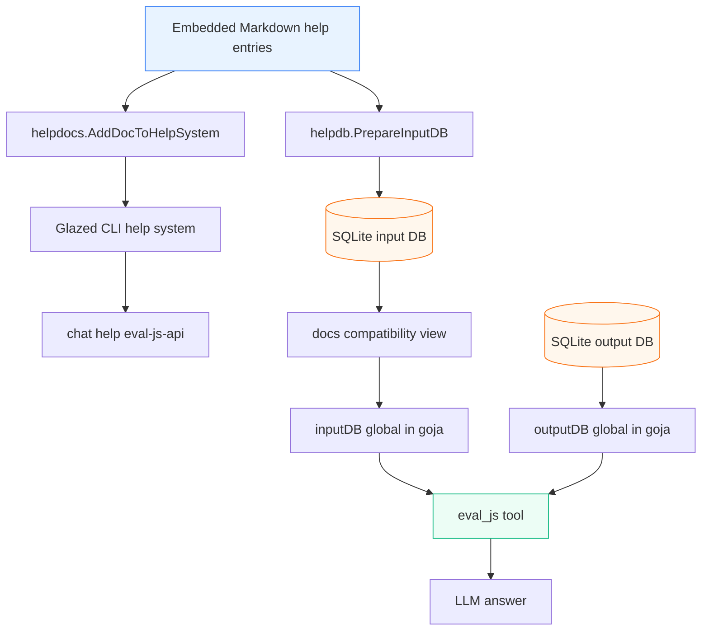
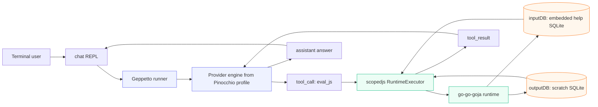
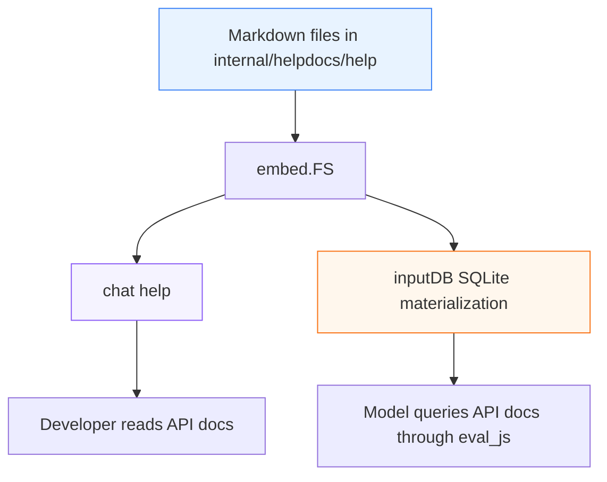
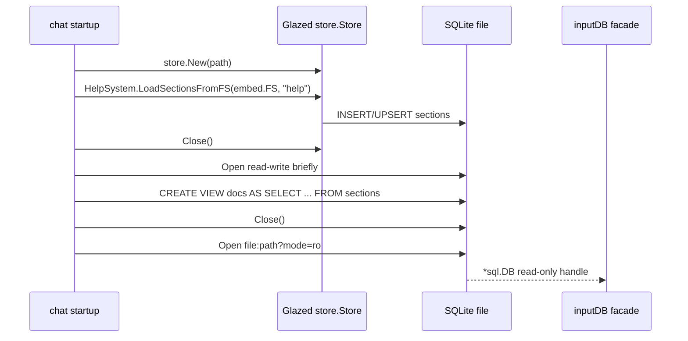
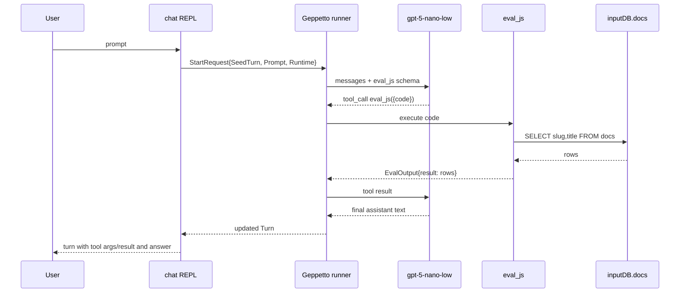

# Building a Tool-Using Go Chat Agent with Geppetto, go-go-goja, and Glazed Help

This note is a deep-dive tutorial about the `chat` agent built in `/home/manuel/code/wesen/2026-04-29--go-go-agent`. The project implements a small stdin/stdout LLM chatbot that can call one tool, `eval_js`, to execute JavaScript against an embedded help database. The implementation combines four local framework pieces: Geppetto for inference and tool loops, Pinocchio for profile resolution, go-go-goja for a JavaScript runtime, and Glazed for embedded help entries and SQLite-backed documentation storage.

The goal of this article is not only to explain this specific repo, but also to preserve a reusable pattern: **build a self-documenting Go agent by embedding its own API reference pages, loading them into a local SQLite help database, and exposing that database to the model through one constrained JavaScript tool.**

> [!summary]
> - The `chat` binary embeds Glazed help entries, registers them into an input SQLite database, and exposes that database as `inputDB` inside a goja runtime.
> - Geppetto's runner and tool loop advertise exactly one model-facing tool, `eval_js`, implemented with `geppetto/pkg/inference/tools/scopedjs`.
> - Pinocchio profile bootstrap supplies the actual inference settings, so the app can run with profiles such as `gpt-5-nano-low`.
> - The live tmux smoke test proved that `gpt-5-nano-low` calls `eval_js`, emits SQL in the tool arguments, receives rows from `inputDB.docs`, and summarizes the embedded help entries.

## Why this note exists

The implementation grew out of a design ticket named `LLM-EVAL-JS-CHATBOT`. The original request was to create a simple LLM chatbot with a single `eval_js` tool that runs inside a go-go-goja sandbox. The sandbox should have two SQLite-backed globals, `inputDB` and `outputDB`, so JavaScript generated by the model can query documentation and write scratch results.

The scope was then sharpened:

- the app should be named `chat`
- version 1 does **not** need to ingest help pages from external binaries
- instead, the app should embed its own relevant API reference pages
- those embedded pages should be registered programmatically into the input DB
- the same embedded pages should also be available through the binary's normal Glazed-style `help` command
- the REPL should show tool-call arguments so a developer can see exactly what JavaScript/SQL the model generated

This is a good durable pattern because agents often fail when their tool APIs are only described in source code or prompt strings. Here, the API reference is a first-class artifact: it is embedded into the binary, queryable through SQLite, browsable through CLI help, and visible to the model through `eval_js`.

## Current project status

The repository currently contains a working prototype.

Main repo:

```text
/home/manuel/code/wesen/2026-04-29--go-go-agent
```

Important implementation commits:

```text
15de510 Implement chat eval_js prototype
9345f24 Wire chat logging help and tool details
1f409fb Diary: record gpt-5-nano-low tmux smoke
```

Validated commands:

```bash
go test ./...
go run ./cmd/chat --help
go run ./cmd/chat help eval-js-api
go run ./cmd/chat --profile gpt-5-nano-low
```

The live `gpt-5-nano-low` tmux run produced a real tool call:

```text
tool_call: name=eval_js id=call_7L2IuPUfmtv2gMz2R8knxQ2d
  args: {"code":"const rows = inputDB.query(\"SELECT slug, title FROM docs ORDER BY title\"); return rows;"}
tool_result: id=call_7L2IuPUfmtv2gMz2R8knxQ2d
  result: {"result":[{"slug":"database-globals-api","title":"Database Globals API"},{"slug":"chat-repl-user-guide","title":"chat REPL User Guide"},{"slug":"eval-js-api","title":"eval_js Tool API"}]}
```

That is the important end-to-end proof: the model saw the `eval_js` tool, decided to use it, generated JavaScript that queried the embedded help DB, and used the result in its final answer.

## Repository map

The project is intentionally small. The important files are:

```text
2026-04-29--go-go-agent/
├── cmd/chat/main.go
├── internal/
│   ├── evaljs/
│   │   ├── runtime.go
│   │   └── runtime_test.go
│   ├── helpdb/
│   │   ├── helpdb.go
│   │   └── helpdb_test.go
│   ├── helpdocs/
│   │   ├── docs.go
│   │   └── help/
│   │       ├── 01-eval-js-api.md
│   │       ├── 02-database-globals.md
│   │       └── 03-chat-repl.md
│   └── jsdb/
│       └── facade.go
├── go.mod
├── go.sum
└── ttmp/2026/04/29/LLM-EVAL-JS-CHATBOT--...
```

What each part owns:

- `cmd/chat/main.go` owns the CLI root, Glazed-style logging/help setup, Pinocchio profile resolution, REPL loop, Geppetto runner invocation, and turn printing.
- `internal/helpdocs` owns the embedded Markdown help pages and exposes `AddDocToHelpSystem`.
- `internal/helpdb` materializes the embedded help pages into a SQLite input DB and creates the writable output scratch DB.
- `internal/jsdb` defines the JavaScript-facing SQLite facade methods.
- `internal/evaljs` builds the goja/scopedjs runtime and registers the `eval_js` tool.
- `ttmp/.../LLM-EVAL-JS-CHATBOT...` stores the design doc, diary, evidence, and implementation tasks.

## The core mental model

The system has two parallel surfaces over the same embedded documentation:

1. **Human-facing CLI help**: `chat help eval-js-api`
2. **Model-facing help database**: `inputDB.query("SELECT ... FROM docs")` inside `eval_js`

Both are backed by the same embedded Markdown files.



The important design rule is: **do not let the model learn tool APIs from scattered comments or a one-off prompt. Put the API documentation into help entries, embed them, and make them queryable.**

This makes the binary self-describing in three ways:

- developers can run `chat help`
- the model can query `inputDB.docs`
- tests can assert that embedded help entries are present in the input DB

## Runtime architecture

At runtime, `chat` does four setup passes before it enters the REPL:

1. initialize the Cobra/Glazed root command
2. resolve Pinocchio profile settings into Geppetto inference settings
3. build the SQLite input/output databases
4. build and register the `eval_js` runtime/tool



The system is deliberately not a general-purpose shell. It does not expose filesystem or process execution modules. The only intended capability is JavaScript evaluation against the two SQLite facades.

## Step 1: Build a Glazed-style root command

The root command lives in `cmd/chat/main.go`. It is currently a Cobra command, but it is initialized like a Glazed CLI:

```go
cmd := &cobra.Command{
    Use:   "chat",
    Short: "Simple Geppetto chat REPL with an eval_js documentation tool",
    PersistentPreRunE: func(cmd *cobra.Command, args []string) error {
        return logging.InitLoggerFromCobra(cmd)
    },
    RunE: func(cmd *cobra.Command, args []string) error {
        return run(ctx, s, args, cmd.InOrStdin(), cmd.OutOrStdout(), cmd.ErrOrStderr())
    },
}

if err := logging.AddLoggingSectionToRootCommand(cmd, "chat"); err != nil {
    // handle error
}

helpSystem := help.NewHelpSystem()
if err := helpdocs.AddDocToHelpSystem(helpSystem); err != nil {
    // handle error
}
help_cmd.SetupCobraRootCommand(helpSystem, cmd)
```

This gives the binary:

- standard logging flags such as `--log-level`, `--log-format`, and `--log-file`
- Glazed help browsing through `chat help`
- lookup by slug, for example `chat help eval-js-api`
- one root-level initialization path for logging and help

This matters because the app should behave like the surrounding Go-Go-Golems CLIs. A plain Cobra `--help` is not enough if the binary contains structured help pages.

### Current root flags

The root also defines app-specific flags:

```text
--config-file          explicit Pinocchio config/profile file
--profile              Pinocchio profile to load
--profile-registries   profile registry source, repeatable
--input-db             optional path for materialized embedded help input DB
--output-db            optional path for writable scratch output DB
--eval-timeout         eval_js execution timeout
--max-output-chars     max string/console output characters from eval_js
```

The profile flags are intentionally Pinocchio-shaped, not a new profile format. That keeps the agent compatible with the existing profile registry ecosystem.

## Step 2: Embed help entries once and reuse them twice

The embedded docs live in `internal/helpdocs/help/`.

```text
internal/helpdocs/help/01-eval-js-api.md
internal/helpdocs/help/02-database-globals.md
internal/helpdocs/help/03-chat-repl.md
```

`internal/helpdocs/docs.go` embeds them:

```go
//go:embed help/*.md
var FS embed.FS

const Dir = "help"

func AddDocToHelpSystem(helpSystem *help.HelpSystem) error {
    return helpSystem.LoadSectionsFromFS(FS, Dir)
}
```

This helper is small, but it is one of the most important design points in the project. It ensures CLI help and model-visible help use the same source files.



A future developer should keep adding API reference pages here. Good candidates are:

- `eval_js` contract
- `inputDB` / `outputDB` contract
- SQL schema examples
- REPL usage
- known limitations
- examples of safe queries

## Step 3: Materialize embedded help into the input DB

The input DB is built in `internal/helpdb/helpdb.go`.

The main function is `PrepareInputDB`:

```go
func PrepareInputDB(ctx context.Context, cfg InputDBConfig) (*PreparedDB, error)
```

Its job is:

1. decide a DB path
2. create a Glazed `store.Store` at that path
3. load embedded Markdown sections into that store
4. close the Glazed store
5. reopen the SQLite file and create a `docs` compatibility view
6. reopen the file in read-only mode for JavaScript

The lifecycle is intentionally explicit:



The view exists because Glazed's actual help schema uses a `sections` table, while the model-facing API is easier to explain as a `docs` view:

```sql
CREATE VIEW IF NOT EXISTS docs AS
SELECT
  id,
  slug,
  section_type,
  title,
  sub_title,
  short,
  content,
  topics,
  flags,
  commands,
  is_top_level,
  is_template,
  show_per_default,
  order_num,
  created_at,
  updated_at
FROM sections;
```

A model can then query either:

```javascript
inputDB.query("SELECT slug, title FROM docs ORDER BY title")
```

or:

```javascript
inputDB.query("SELECT slug, title FROM sections ORDER BY title")
```

but the examples prefer `docs`.

### Why close and reopen the store?

Glazed's `store.Store` owns an unexported `*sql.DB`. That means `PrepareInputDB` cannot just reach into the store and create the compatibility view directly through a public field. The safe implementation is:

```text
create Glazed store
load sections
close Glazed store
open SQLite directly
create view
close direct handle
open read-only for JS
```

This looks slightly awkward, but it preserves package boundaries and still gives the JavaScript runtime a clean `*sql.DB` handle.

## Step 4: Create outputDB as writable scratch space

The same package creates the output DB:

```go
func PrepareOutputDB(ctx context.Context, path string) (*PreparedDB, error)
```

If no path is provided, it creates a temporary SQLite file. It then creates one default table:

```sql
CREATE TABLE IF NOT EXISTS notes (
  id INTEGER PRIMARY KEY AUTOINCREMENT,
  key TEXT,
  value TEXT,
  created_at DATETIME DEFAULT CURRENT_TIMESTAMP
);
```

This is intentionally minimal. The model can write derived facts, summaries, or temporary records here without mutating the embedded help DB.

Example JavaScript:

```javascript
outputDB.exec(
  "INSERT INTO notes(key, value) VALUES (?, ?)",
  "summary",
  "eval_js can query embedded help docs"
);
return outputDB.query("SELECT * FROM notes ORDER BY id DESC LIMIT 5");
```

Version 1 treats `outputDB` as process-local scratch unless the user passes `--output-db`.

## Step 5: Bind database facades into JavaScript

The JavaScript-facing DB API is implemented in `internal/jsdb/facade.go`.

The facade exposes three methods:

```go
func (f *Facade) Query(query string, args ...any) ([]map[string]any, error)
func (f *Facade) Exec(query string, args ...any) (ExecResult, error)
func (f *Facade) Schema() SchemaSummary
```

The key policy is the `Readonly` flag:

```go
type Facade struct {
    Name     string
    DB       *sql.DB
    Readonly bool
    Tables   []string
}
```

`inputDB` is created with `Readonly: true`, so writes fail before they reach SQLite:

```go
if f.Readonly {
    return ExecResult{}, fmt.Errorf("%s is read-only", f.name())
}
```

`Query` also rejects non-read statements when the facade is read-only:

```go
if f.Readonly && !isReadQuery(query) {
    return nil, fmt.Errorf("%s only allows SELECT/WITH queries", f.name())
}
```

The current read check is intentionally simple:

```go
func isReadQuery(query string) bool {
    q := strings.TrimSpace(strings.TrimPrefix(query, "\ufeff"))
    q = strings.ToLower(q)
    return strings.HasPrefix(q, "select") || strings.HasPrefix(q, "with")
}
```

This is not a full SQL sandbox. It is a first guardrail plus read-only SQLite opening. If the agent grows more powerful, this should be replaced or augmented with a stricter SQL validator/authorizer similar to Geppetto's `scopeddb` package.

### Lower-case JavaScript methods

The facade binds a goja object explicitly:

```go
obj := ctx.VM.NewObject()
obj.Set("query", f.Query)
obj.Set("exec", f.Exec)
obj.Set("schema", f.Schema)
ctx.VM.Set(globalName, obj)
```

This is better than exposing the Go struct directly because JavaScript gets idiomatic lower-case method names:

```javascript
inputDB.query(...)
outputDB.exec(...)
inputDB.schema()
```

## Step 6: Build the eval_js runtime with scopedjs

The `eval_js` tool is implemented in `internal/evaljs/runtime.go`.

The central abstraction is Geppetto's `scopedjs.EnvironmentSpec`:

```go
func NewSpec(opts Options) scopedjs.EnvironmentSpec[Scope, Meta]
```

The spec defines:

- runtime label
- tool name: `eval_js`
- tool description
- starter snippets
- eval timeout and output limits
- runtime `Configure` callback

The `Scope` is small:

```go
type Scope struct {
    InputDB  *sql.DB
    OutputDB *sql.DB
}
```

The runtime configuration binds globals:

```go
input := &jsdb.Facade{
    Name:     "inputDB",
    DB:       scope.InputDB,
    Readonly: true,
    Tables:   []string{"sections", "docs"},
}

output := &jsdb.Facade{
    Name:     "outputDB",
    DB:       scope.OutputDB,
    Readonly: false,
    Tables:   []string{"notes"},
}
```

Then it registers them with the scopedjs builder:

```go
name, bind, doc := input.BindGlobal("inputDB", scopedjs.GlobalDoc{...})
b.AddGlobal(name, bind, doc)

name, bind, doc = output.BindGlobal("outputDB", scopedjs.GlobalDoc{...})
b.AddGlobal(name, bind, doc)
```

It also adds helper documentation:

```go
b.AddHelper(
    "parameterized SQL",
    `inputDB.query("SELECT * FROM docs WHERE slug = ?", slug)`,
    "Use ? placeholders and pass bind arguments after the SQL string.",
)
```

### The tool registrar

The runtime object exposes a Geppetto runner-compatible registrar:

```go
func (r *Runtime) Registrar() runner.ToolRegistrar {
    return func(ctx context.Context, reg geptools.ToolRegistry) error {
        return scopedjs.RegisterPrebuilt(reg, r.Spec, r.Handle, scopedjs.EvalOptionOverrides{})
    }
}
```

This means `cmd/chat/main.go` can pass the registrar into `runner.Runtime`:

```go
runtime := runner.Runtime{
    InferenceSettings: resolved.FinalInferenceSettings,
    ToolRegistrars:   []runner.ToolRegistrar{evalRuntime.Registrar()},
    ToolNames:        []string{evaljs.ToolName},
}
```

The current implementation uses a **prebuilt runtime**: one goja runtime is built when the process starts, then reused for calls. This is fast and simple, but it means JavaScript global state can persist across tool calls. If that becomes confusing, switch to a lazy/fresh runtime pattern.

## Step 7: Resolve profiles with Pinocchio

`chat` does not invent a profile system. It delegates to Pinocchio's profile bootstrap package:

```go
parsed, err := profilebootstrap.NewCLISelectionValues(profilebootstrap.CLISelectionInput{
    ConfigFile:        s.ConfigFile,
    Profile:           s.Profile,
    ProfileRegistries: s.ProfileRegistries,
})

resolved, err := profilebootstrap.ResolveCLIEngineSettings(ctx, parsed)
```

The result supplies `FinalInferenceSettings`, which Geppetto's runner consumes:

```go
runtime := runner.Runtime{
    InferenceSettings: resolved.FinalInferenceSettings,
    ToolRegistrars:   []runner.ToolRegistrar{evalRuntime.Registrar()},
    ToolNames:        []string{evaljs.ToolName},
}
```

This is important because profile resolution is a common source of accidental duplication. The app should use the same profile path as other Pinocchio commands, so profiles like `gpt-5-nano-low` work without new configuration formats.

## Step 8: Run inference through Geppetto's runner

The REPL loop keeps an in-memory `turns.Turn` seed and calls:

```go
_, updated, err := r.Run(ctx, runner.StartRequest{
    SeedTurn: seed,
    Prompt:   prompt,
    Runtime:  runtime,
})
```

The seed starts with a system instruction that tells the model it has one tool:

```text
You are the chat agent.
You have exactly one tool available: eval_js.
Use eval_js when the user asks about the embedded chat help entries, the JavaScript runtime APIs, inputDB/outputDB, or implementation details captured in the embedded help database.
The eval_js runtime exposes inputDB as a read-only SQLite facade over embedded help entries and outputDB as writable scratch space.
Prefer small SELECT queries against inputDB.docs or inputDB.sections, and cite help slugs/titles when answering.
```

After the run completes, the REPL prints the full turn with tool details:

```go
turns.FprintfTurn(out, updated, turns.WithToolDetail(true))
```

That is what makes tool arguments visible:

```text
tool_call: name=eval_js id=...
  args: {"code":"const rows = inputDB.query(...)"}
tool_result: id=...
  result: {...}
```

This is excellent for development. A later user-facing version may want a `--tool-details` flag and default to assistant-only output.

## End-to-end flow in pseudocode

A simplified version of startup looks like this:

```go
func run(ctx context.Context, settings Settings) error {
    parsed := profilebootstrap.NewCLISelectionValues(settings.profileInput())
    resolved := profilebootstrap.ResolveCLIEngineSettings(ctx, parsed)
    defer resolved.Close()

    input := helpdb.PrepareInputDB(ctx, helpdb.InputDBConfig{
        HelpFS:  helpdocs.FS,
        HelpDir: helpdocs.Dir,
    })
    defer input.Close()

    output := helpdb.PrepareOutputDB(ctx, settings.OutputDBPath)
    defer output.Close()

    evalRuntime := evaljs.Build(ctx, evaljs.Scope{
        InputDB:  input.DB,
        OutputDB: output.DB,
    })
    defer evalRuntime.Close()

    geppettoRuntime := runner.Runtime{
        InferenceSettings: resolved.FinalInferenceSettings,
        ToolRegistrars:   []runner.ToolRegistrar{evalRuntime.Registrar()},
        ToolNames:        []string{"eval_js"},
    }

    return repl(ctx, runner.New(), geppettoRuntime)
}
```

The tool-call loop is handled by Geppetto's runner and tool loop:



## Live validation with gpt-5-nano-low

The live tmux smoke test used:

```bash
tmux new-session -d -s chat-gpt5-nano-low-test2 -c /home/manuel/code/wesen/2026-04-29--go-go-agent 'bash'
tmux send-keys -t chat-gpt5-nano-low-test2 'go run ./cmd/chat --profile gpt-5-nano-low' C-m
tmux send-keys -t chat-gpt5-nano-low-test2 'Use eval_js to list the embedded help entries, then summarize the available APIs in one paragraph.' C-m
```

The captured output is stored in the ticket evidence file:

```text
/home/manuel/code/wesen/2026-04-29--go-go-agent/ttmp/2026/04/29/LLM-EVAL-JS-CHATBOT--design-simple-geppetto-chatbot-with-go-go-goja-eval-js-tool/sources/tmux-gpt5-nano-low-smoke-with-args.txt
```

The model generated this tool argument:

```json
{
  "code": "const rows = inputDB.query(\"SELECT slug, title FROM docs ORDER BY title\"); return rows;"
}
```

and received:

```json
{
  "result": [
    {"slug": "database-globals-api", "title": "Database Globals API"},
    {"slug": "chat-repl-user-guide", "title": "chat REPL User Guide"},
    {"slug": "eval-js-api", "title": "eval_js Tool API"}
  ]
}
```

That validates the whole chain:

```text
Pinocchio profile -> Geppetto runner -> tool advertisement -> model tool call -> scopedjs -> goja -> inputDB -> final answer
```

## Tests currently in the repo

The tests are deliberately close to the system boundaries.

### helpdb tests

`internal/helpdb/helpdb_test.go` verifies:

- embedded help pages load into the input DB
- the `docs` compatibility view is queryable
- expected slugs are present:
  - `eval-js-api`
  - `database-globals-api`
  - `chat-repl-user-guide`
- the output DB creates and writes to `notes`

### evaljs tests

`internal/evaljs/runtime_test.go` verifies:

- `eval_js` can query embedded help through `inputDB`
- `eval_js` can write scratch data through `outputDB`
- `inputDB.exec(...)` is rejected as read-only

The core test script is representative:

```javascript
const rows = inputDB.query(
  "SELECT slug, title FROM docs WHERE slug = ?",
  "eval-js-api"
);
outputDB.exec(
  "INSERT INTO notes(key, value) VALUES (?, ?)",
  "seen",
  rows[0].slug
);
return {
  slug: rows[0].slug,
  notes: outputDB.query("SELECT key, value FROM notes")
};
```

Run all tests with:

```bash
go test ./...
```

## Common failure modes

### Tool call not visible

Symptom:

```text
tool_call: eval_js
```

but no arguments.

Cause: the REPL is using `turns.FprintTurn`, which prints a compact transcript.

Fix: use:

```go
turns.FprintfTurn(out, updated, turns.WithToolDetail(true))
```

### Missing go.sum entries after wiring Glazed help

Symptom:

```text
missing go.sum entry for module providing package github.com/charmbracelet/bubbletea
missing go.sum entry for module providing package gopkg.in/natefinch/lumberjack.v2
```

Cause: `help_cmd.SetupCobraRootCommand` and Glazed logging pull in transitive help UI/logging packages.

Fix:

```bash
go mod tidy
```

### `docs` table missing

Symptom:

```text
no such table: docs
```

Cause: Glazed's real table is `sections`; `docs` is a compatibility view created by `PrepareInputDB`.

Fix: make sure `ensureDocsView` runs after loading sections and before opening the DB read-only.

### Input DB write rejected

Symptom:

```text
inputDB is read-only
```

Cause: this is expected. The source help DB is intentionally read-only. Use `outputDB.exec(...)` for scratch writes.

### Duplicated heading in `chat help eval-js-api`

Symptom: the rendered help shows the title twice.

Cause: the embedded Markdown pages currently include top-level `#` headings in their body. Glazed already renders the title from frontmatter.

Fix: remove top-level `#` headings from embedded help page content and let Glazed render the page title.

## Anti-patterns

### Do not describe tools only in the system prompt

A prompt-only API description is hard to test, easy to drift, and invisible to CLI users. Prefer embedded help entries that are both human-readable and model-queryable.

### Do not create a separate documentation source for the model

If CLI help and `inputDB` come from different files, they will drift. Use one embedded source and register it into both surfaces.

### Do not expose filesystem or process execution in v1

The point of this agent is a bounded documentation/query runtime. Adding `fs`, `exec`, or network access turns it into a much larger sandboxing problem.

### Do not write a custom profile loader

Pinocchio already owns profile resolution. Use `profilebootstrap` so the app works with existing profile names and registries.

### Do not hide tool arguments during development

For a tool-using agent, debugging begins with the tool arguments. If you cannot see generated JavaScript/SQL, you cannot understand model behavior.

## Recommended implementation sequence for a new developer

If you want to build a similar agent from scratch, follow this order:

1. **Create embedded help pages first.** Write the API pages you want the model to be able to query.
2. **Wire Glazed root help.** Make `myapp help <slug>` work before thinking about LLMs.
3. **Materialize help into SQLite.** Load the same embedded pages into a Glazed `store.Store`.
4. **Create a model-friendly view.** If the native schema is `sections`, add a simple `docs` view.
5. **Build JavaScript DB facades.** Bind `query`, `exec`, and `schema` explicitly with lower-case JS method names.
6. **Use `scopedjs` for eval.** Do not hand-roll eval wrapping, console capture, tool schemas, and runtime cleanup unless necessary.
7. **Use the existing profile system.** Let Pinocchio resolve inference settings.
8. **Print tool details during development.** Show args and results until the agent behavior is boring and reliable.
9. **Add a live tmux smoke test.** Unit tests prove mechanics; tmux proves the model actually uses the tool.

## Working rules for this pattern

- Embedded help is the single source of truth.
- The model should be able to query its own API reference.
- `inputDB` is read-only.
- `outputDB` is scratch.
- `eval_js` is the only model-facing tool in version 1.
- Tool-call arguments must be visible during development.
- Glazed-style logging and help belong at the root command.
- Pinocchio owns profile loading.
- Geppetto owns the runner/tool loop.
- go-go-goja owns JavaScript execution.

## Related project docs and source references

Project ticket:

```text
/home/manuel/code/wesen/2026-04-29--go-go-agent/ttmp/2026/04/29/LLM-EVAL-JS-CHATBOT--design-simple-geppetto-chatbot-with-go-go-goja-eval-js-tool
```

Primary design doc:

```text
ttmp/2026/04/29/LLM-EVAL-JS-CHATBOT--design-simple-geppetto-chatbot-with-go-go-goja-eval-js-tool/design-doc/01-geppetto-eval-js-chatbot-design-and-implementation-guide.md
```

Implementation diary:

```text
ttmp/2026/04/29/LLM-EVAL-JS-CHATBOT--design-simple-geppetto-chatbot-with-go-go-goja-eval-js-tool/reference/01-investigation-diary.md
```

Live smoke evidence:

```text
ttmp/2026/04/29/LLM-EVAL-JS-CHATBOT--design-simple-geppetto-chatbot-with-go-go-goja-eval-js-tool/sources/tmux-gpt5-nano-low-smoke-with-args.txt
```

Important local framework docs:

```text
/home/manuel/code/wesen/corporate-headquarters/geppetto/pkg/doc/tutorials/07-build-scopedjs-eval-tools.md
/home/manuel/code/wesen/corporate-headquarters/geppetto/pkg/doc/topics/07-tools.md
/home/manuel/code/wesen/corporate-headquarters/geppetto/pkg/doc/topics/10-runner.md
/home/manuel/code/wesen/corporate-headquarters/pinocchio/pkg/doc/topics/pinocchio-profile-resolution-and-runtime-switching.md
/home/manuel/code/wesen/corporate-headquarters/glazed/pkg/doc/topics/01-help-system.md
/home/manuel/code/wesen/corporate-headquarters/glazed/pkg/doc/topics/14-writing-help-entries.md
/home/manuel/code/wesen/corporate-headquarters/go-go-goja/README.md
```

Important implementation files:

```text
/home/manuel/code/wesen/2026-04-29--go-go-agent/cmd/chat/main.go
/home/manuel/code/wesen/2026-04-29--go-go-agent/internal/helpdocs/docs.go
/home/manuel/code/wesen/2026-04-29--go-go-agent/internal/helpdb/helpdb.go
/home/manuel/code/wesen/2026-04-29--go-go-agent/internal/jsdb/facade.go
/home/manuel/code/wesen/2026-04-29--go-go-agent/internal/evaljs/runtime.go
/home/manuel/code/wesen/2026-04-29--go-go-agent/internal/evaljs/runtime_test.go
/home/manuel/code/wesen/2026-04-29--go-go-agent/internal/helpdb/helpdb_test.go
```

## Near-term next steps

The prototype works, but there are several obvious polish tasks:

1. Add a `--tool-details` or `--assistant-only` output mode so normal users are not forced to see full tool JSON.
2. Remove top-level `#` headings from embedded help pages to avoid duplicated titles in `chat help` output.
3. Add a small integration test around `runner.Prepare` to assert that only `eval_js` is registered.
4. Consider a stricter SQL validator for `inputDB.query`, especially if the embedded DB grows beyond help docs.
5. Add more embedded API examples as the agent surface grows.
6. Add a `chat help examples` style help entry that shows good prompts and expected tool calls.

## Final takeaway

The central trick is to treat the agent's own documentation as runtime data. Once help entries are embedded into the binary and loaded into SQLite, the LLM does not have to guess how the tool works. It can ask the local database. That gives you a small but powerful loop:

```text
write help page -> embed in binary -> load into inputDB -> model queries it -> better tool use
```

This pattern scales well for small tool-using agents because it keeps the implementation, developer docs, CLI help, and model-visible reference material tied to the same source files.
